# AI 空耳單字 APP－Google Play MVP 規劃書

> 文件格式：Markdown  
> 目標平台：Google Play／Android  
> 專案定位：小型、可上架、低成本、快速驗證  
> 核心輸入：手動輸入單字、圖片 OCR  
> 核心輸出：詞義、正式讀音、正式發音、AI 近似音候選  
> 文件版本：MVP v1.0

---

## 目錄

1. 專案摘要
2. MVP 範圍
3. 使用者操作流程
4. 功能需求
5. 畫面設計
6. 系統架構
7. AI Agent 設計
8. 資料設計
9. API 設計
10. 適當硬體支援列表
11. Google Play 上架需求
12. 資安與隱私
13. 開發時程
14. 整體成本估算
15. 測試與驗收
16. 風險與後續擴充
17. 最終交付項目

---

# 一、專案摘要

## 1.1 產品目的

開發一款可上架至 Google Play 的小型語言學習 APP。使用者可透過：

- 手動輸入外語單字
- 拍照取得圖片文字
- 從手機相簿選擇圖片

取得詞義、正式讀音及 AI 產生的台灣華語近似音，並將結果儲存成個人單字卡。

## 1.2 產品核心價值

使用者不需要自行整理以下內容：

- 單字
- 詞義
- 讀音
- 空耳近似音
- 記憶提示

系統協助自動產生初稿，使用者只需判斷：

- 發音像不像
- 是否容易記住
- 是否要儲存

## 1.3 MVP 核心流程

```text
輸入單字或圖片
→ 選擇文字
→ AI 分析
→ 顯示正式讀音與近似音
→ 使用者選擇
→ 儲存單字卡
```

---

# 二、MVP 範圍

## 2.1 納入功能

| 編號 | 功能 | MVP |
|---|---|---:|
| F01 | 手動輸入單字 | 必要 |
| F02 | 拍照取得圖片 | 必要 |
| F03 | 從相簿選擇圖片 | 必要 |
| F04 | 手機端 OCR | 必要 |
| F05 | OCR 文字校正及選取 | 必要 |
| F06 | 英文、日文語言判斷 | 必要 |
| F07 | 顯示繁體中文詞義 | 必要 |
| F08 | 顯示正式讀音 | 必要 |
| F09 | 播放正式發音 | 必要 |
| F10 | AI 產生近似音候選 | 必要 |
| F11 | 顯示注音或羅馬拼音 | 必要 |
| F12 | 選擇近似音候選 | 必要 |
| F13 | 儲存本機單字卡 | 必要 |
| F14 | 查看及刪除單字卡 | 必要 |
| F15 | 防止重複儲存 | 必要 |
| F16 | 基本 AI 使用次數限制 | 必要 |
| F17 | 隱私權政策及資料說明 | 必要 |

## 2.2 首版支援項目

| 項目 | MVP 支援內容 |
|---|---|
| 平台 | Android |
| 上架平台 | Google Play |
| 前端語言 | 台灣繁體中文 |
| 來源語言 | 英文、日文 |
| 輸入 | 單字、手機圖片 |
| OCR | Google ML Kit 裝置端 OCR |
| 發音 | Android TTS |
| 記憶表示 | 正體中文、注音、羅馬拼音或混合 |
| 單字卡 | 手機 SQLite |
| 雲端功能 | AI 分析 API |
| 使用者帳號 | 首版不做 |
| 跨裝置同步 | 首版不做 |

## 2.3 不納入功能

- 梗圖產生
- 動漫新番資料
- 文章及文件分析
- 社群分享
- 排行榜
- 使用者錄音辨識
- 發音評分
- 複雜間隔複習
- 帳號註冊及登入
- 跨裝置同步
- 管理後台
- 完全自主多 Agent
- iOS 版本
- 完整支援所有語言

---

# 三、使用者操作流程

## 3.1 整體流程圖

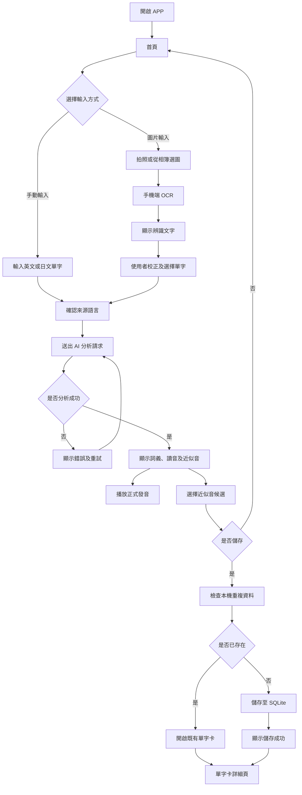

## 3.2 圖片處理原則

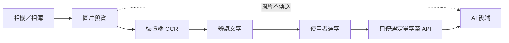

圖片原檔不傳送至後端，只有使用者選定的單字會送往 AI API。

---

# 四、功能需求

## 4.1 手動輸入單字

### 輸入欄位

| 欄位 | 必填 | 規則 |
|---|---:|---|
| 單字／短語 | 是 | 最多五十個 Unicode 字元 |
| 來源語言 | 否 | 預設自動判斷 |
| 記憶語言 | 是 | MVP 固定台灣華語 |
| 標記偏好 | 是 | 注音、羅馬拼音、混合 |

### 驗證規則

- 不允許純空白。
- 移除頭尾空白。
- 清除不可見控制字元。
- MVP 以單字或短語為主。
- 過長文字提示改用較短內容。
- 無法判斷語言時要求使用者選擇英文或日文。

---

## 4.2 圖片 OCR

### 來源

- Android 相機
- Android Photo Picker

### 規則

- 支援 JPEG、PNG、WebP。
- 圖片於手機端進行 OCR。
- 不將圖片上傳到自有後端。
- 顯示辨識文字供使用者修改。
- 使用者選定單字後才呼叫 AI API。
- OCR 無結果時可改為手動輸入。

---

## 4.3 AI 分析結果

每次分析回傳：

- 原始單字
- 正規化單字
- 來源語言
- 繁體中文詞義
- 正式讀音文字
- 二至三個近似音候選
- 注音、羅馬拼音或混合標記
- 簡短記憶提示
- AI 內容聲明

## 4.4 正式發音

使用 Android TTS：

- 英文使用對應英文語音。
- 日文使用對應日文語音。
- 裝置不支援時提示安裝語音套件。
- TTS 失敗時仍顯示讀音文字。
- 近似音不可標示為正式發音。

## 4.5 本機單字卡

可執行：

- 新增
- 查詢
- 查看詳細內容
- 刪除
- 依來源語言篩選
- 防止相同語言及相同單字重複儲存

---

# 五、畫面設計

> Mermaid 不適合取代正式 UI Mockup，但可用於 MVP 線框及版面區塊設計。

## 5.1 畫面導覽

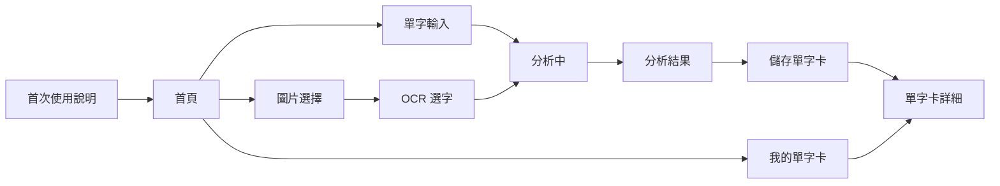

---

## 5.2 首次使用說明

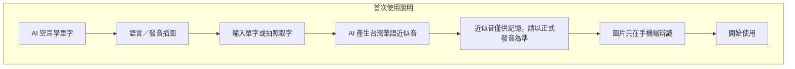

---

## 5.3 首頁設計

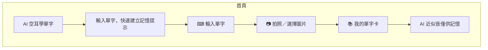

### 版面重點

- 首頁只有三個主要功能入口。
- 不放置廣告或非必要資訊。
- 「輸入單字」作為主要按鈕。
- 圖片入口標明 OCR 在手機端執行。

---

## 5.4 單字輸入畫面

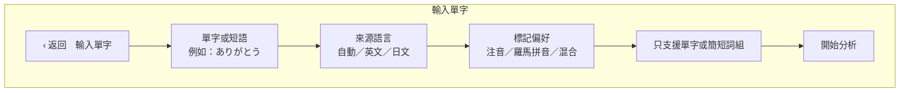

---

## 5.5 圖片選擇畫面

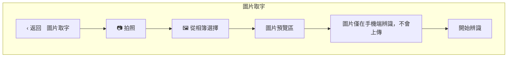

---

## 5.6 OCR 選字畫面

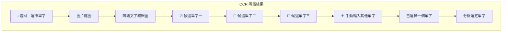

### MVP 簡化建議

第一版每次只允許分析一個單字。雖然 OCR 可辨識多個字詞，但使用者一次選一個，可降低：

- AI API 成本
- 畫面複雜度
- 批次錯誤處理
- 等候時間
- 資料儲存複雜度

---

## 5.7 分析中畫面

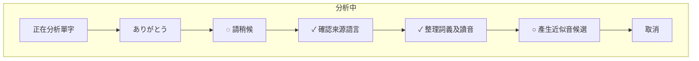

實際後端可為單一 API 呼叫，畫面步驟主要用來改善等待體驗，不需要建立複雜背景工作。

---

## 5.8 分析結果畫面

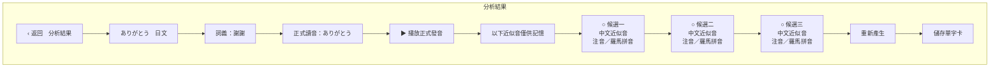

### 操作規則

- 使用者至少選擇一個候選後才能儲存。
- 「重新產生」每日限制次數。
- 重產前提示會使用一次 AI 額度。
- 播放按鈕只播放正式原文，不播放近似音。

---

## 5.9 我的單字卡

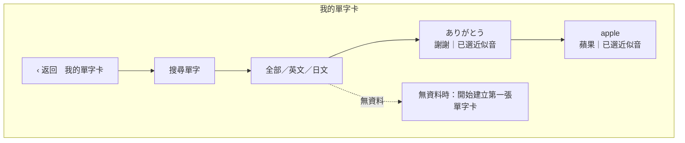

---

## 5.10 單字卡詳細畫面

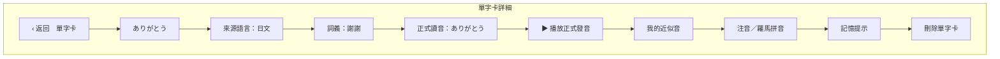

---

# 六、系統架構

## 6.1 簡化架構圖

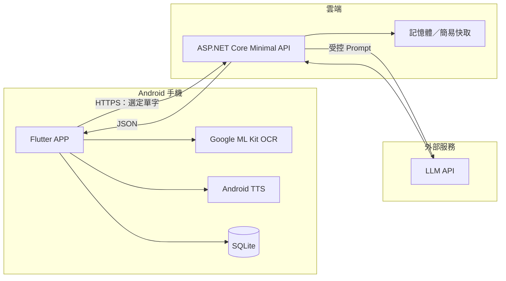

## 6.2 元件責任

| 元件 | 責任 |
|---|---|
| Flutter APP | UI、流程、API 呼叫、資料顯示 |
| ML Kit OCR | 手機端圖片文字辨識 |
| Android TTS | 播放正式單字發音 |
| SQLite | 保存個人單字卡 |
| ASP.NET Core API | 保護 AI Key、限流、Prompt、輸出驗證 |
| LLM | 詞義、讀音整理及近似音生成 |
| 簡易快取 | 避免相同單字重複呼叫 AI |

## 6.3 首版不使用

- SQL Server
- Redis
- Hangfire
- Object Storage
- Kubernetes
- 多台 VM
- 微服務
- 獨立 Worker
- 管理後台

---

# 七、AI Agent 設計

## 7.1 單一分析 Agent

MVP 使用一個受控 Agent，而不是多個自由協作 Agent。

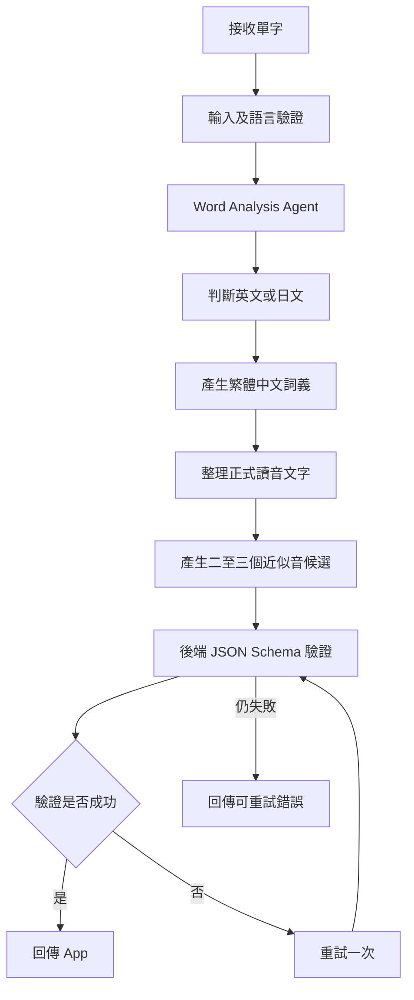

## 7.2 Agent 輸出限制

- 僅輸出 JSON。
- 候選最多三筆。
- 使用台灣繁體中文。
- 不產生圖片。
- 不產生梗圖。
- 不將近似音宣稱為標準發音。
- 不輸出網址。
- 過濾色情、歧視、暴力及人身攻擊內容。
- 無法可靠判斷時明確回傳錯誤。

---

# 八、資料設計

## 8.1 本機資料關聯

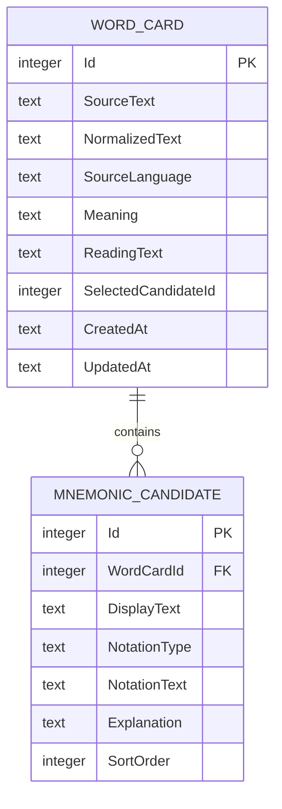

## 8.2 SQLite 建表

```sql
CREATE TABLE WordCard
(
    Id                  INTEGER PRIMARY KEY AUTOINCREMENT,
    SourceText          TEXT NOT NULL,
    NormalizedText      TEXT NOT NULL,
    SourceLanguage      TEXT NOT NULL,
    Meaning             TEXT,
    ReadingText         TEXT,
    SelectedCandidateId INTEGER,
    CreatedAt           TEXT NOT NULL,
    UpdatedAt           TEXT NOT NULL
);

CREATE UNIQUE INDEX UX_WordCard_Language_NormalizedText
ON WordCard
(
    SourceLanguage,
    NormalizedText
);

CREATE TABLE MnemonicCandidate
(
    Id              INTEGER PRIMARY KEY AUTOINCREMENT,
    WordCardId      INTEGER NOT NULL,
    DisplayText     TEXT NOT NULL,
    NotationType    TEXT NOT NULL,
    NotationText    TEXT,
    Explanation     TEXT,
    SortOrder       INTEGER NOT NULL,
    FOREIGN KEY (WordCardId)
        REFERENCES WordCard(Id)
        ON DELETE CASCADE
);
```

## 8.3 重複規則

以下條件相同時視為同一張單字卡：

```text
來源語言＋正規化單字
```

若資料已存在：

- 提示「此單字已存在」。
- 提供「查看既有卡片」。
- 可提供「用本次結果更新」。
- 不直接新增重複資料。

---

# 九、API 設計

## 9.1 分析單字

```http
POST /api/v1/word/analyze
Content-Type: application/json
X-Device-Id: {anonymous-device-id}
```

### Request

```json
{
  "text": "ありがとう",
  "sourceLanguage": "auto",
  "memoryLanguage": "zh-TW",
  "notationPreference": "bopomofo"
}
```

### Response

```json
{
  "sourceText": "ありがとう",
  "normalizedText": "ありがとう",
  "sourceLanguage": "ja-JP",
  "meaning": "謝謝",
  "readingText": "ありがとう",
  "mnemonics": [
    {
      "displayText": "候選近似音",
      "notationType": "bopomofo",
      "notationText": "候選注音",
      "explanation": "簡短記憶提示"
    }
  ],
  "notice": "近似音僅供記憶，請以正式發音為準。"
}
```

## 9.2 API 必要防護

- HTTPS
- 輸入長度限制
- 支援語言白名單
- 裝置及 IP 限流
- AI 逾時
- 最多重試一次
- JSON Schema 驗證
- 不當內容檢查
- API Key 保存在後端
- 不記錄完整個人資料
- 日誌加入匿名 Request ID

---

# 十、適當硬體支援列表

## 10.1 開發電腦

### 建議規格

| 項目 | 建議規格 |
|---|---|
| CPU | Intel Core i5、AMD Ryzen 5 或 Apple Silicon 同級以上 |
| 核心數 | 六核心以上較佳 |
| 記憶體 | 十六 GB，建議三十二 GB |
| 儲存空間 | 五百 GB SSD，至少保留一百 GB 可用空間 |
| 顯示卡 | 不要求獨立顯示卡 |
| 作業系統 | Windows 11 或 macOS |
| 網路 | 穩定寬頻 |
| Android 實機 | 至少一台 |
| 額外設備 | 有拍照功能的 Android 手機 |

### 最低可開發規格

| 項目 | 最低規格 |
|---|---|
| CPU | 四核心 |
| 記憶體 | 八 GB |
| 儲存空間 | 五十 GB 可用 SSD |
| 測試方式 | Android 實機，不建議同時啟動模擬器 |
| 限制 | 編譯及模擬器速度較慢 |

## 10.2 Android 裝置支援

### 建議最低支援

| 項目 | MVP 建議 |
|---|---|
| Android 版本 | Android 9 以上 |
| RAM | 三 GB 以上 |
| 儲存空間 | 至少二百 MB 可用 |
| 相機 | 後置相機 |
| 網路 | AI 分析時需要網路 |
| TTS | 安裝英文或日文語音資料 |
| OCR | 裝置須支援 ML Kit |

### 測試裝置矩陣

| 類型 | 建議測試 |
|---|---|
| 低階裝置 | Android 9、三至四 GB RAM |
| 主流裝置 | Android 12 至 14、六至八 GB RAM |
| 新版裝置 | 最新 Android 版本 |
| 螢幕 | 小螢幕、一般螢幕、大螢幕 |
| 廠牌 | Samsung、Google Pixel，另加一款台灣常見品牌 |

需注意 Google Play 對 Target API Level 的要求會逐年更新，上架時應以當年度 Play Console 規定為準。

## 10.3 後端執行環境

### 方案 A：無伺服器容器，建議

| 項目 | 規格 |
|---|---|
| 平台 | Google Cloud Run、Azure Container Apps 或同級服務 |
| CPU | 一個 vCPU 起 |
| RAM | 五百十二 MB 至一 GB |
| 執行個體 | 零至二個自動擴縮 |
| 儲存 | 無狀態 |
| HTTPS | 平台提供 |
| 優點 | 低流量時成本低、不需維護 VM |
| 缺點 | 可能有冷啟動 |

### 方案 B：小型 Linux VM

| 項目 | 建議規格 |
|---|---|
| CPU | 一至二個 vCPU |
| RAM | 二 GB |
| 儲存空間 | 二十至四十 GB SSD |
| 作業系統 | Ubuntu LTS |
| Runtime | Docker＋ASP.NET Core |
| Reverse Proxy | Caddy 或 Nginx |
| 優點 | 固定環境、容易掌控 |
| 缺點 | 需要更新、備份及安全維護 |

### MVP 建議

優先選擇無伺服器容器，不購買實體伺服器，也不自行架設 GPU。AI 模型由外部 API 提供。

## 10.4 第三方軟體支援

| 項目 | 用途 |
|---|---|
| Flutter SDK | Android APP |
| Android Studio | Android SDK 及簽章 |
| Visual Studio Code／Visual Studio | 程式開發 |
| .NET SDK | ASP.NET Core API |
| SQLite | 本機單字卡 |
| Google ML Kit | 裝置端 OCR |
| Android TTS | 正式發音 |
| GitHub／GitLab | 程式版本控制 |
| Google Play Console | 測試及上架 |
| LLM Provider | AI 詞義及近似音生成 |
| Sentry／同級服務 | 選用的錯誤監控 |

---

# 十一、Google Play 上架需求

## 11.1 必要項目

- Google Play 開發者帳號
- 唯一套件名稱
- 正式 App 名稱
- App Icon
- Feature Graphic
- 手機螢幕截圖
- 簡短說明
- 完整商店說明
- 隱私權政策網址
- Data Safety 表單
- 內容分級問卷
- Android App Bundle
- Release Signing
- Google Play App Signing
- 測試軌道
- 正式版審查

## 11.2 建議權限

| 權限／能力 | 是否使用 | 說明 |
|---|---:|---|
| 網路 | 是 | 呼叫 AI API |
| 相機 | 是 | 拍照取字 |
| Photo Picker | 是 | 選擇圖片 |
| 完整儲存空間存取 | 否 | 無必要 |
| 麥克風 | 否 | MVP 不錄音 |
| 定位 | 否 | 無必要 |
| 聯絡人 | 否 | 無必要 |
| 背景位置 | 否 | 無必要 |

## 11.3 商店聲明

應清楚說明：

- AI 內容可能不完全正確。
- 近似音只用於記憶。
- 正式發音應以 TTS 或可靠字典為準。
- 圖片只在裝置端 OCR。
- 使用者選定文字會傳送到 AI 服務。
- 不應輸入敏感、機密或個人資料。

---

# 十二、資安與隱私

## 12.1 資料流

| 資料 | 是否離開手機 | 說明 |
|---|---:|---|
| 原始圖片 | 否 | 裝置端 OCR |
| OCR 完整結果 | 否 | 僅供使用者選字 |
| 使用者選定單字 | 是 | 傳至自有後端 |
| AI 分析結果 | 是 | 回傳至 APP |
| 單字卡 | 否 | 儲存在 SQLite |
| 裝置識別碼 | 視設計 | 建議使用隨機匿名 ID |
| 使用者帳號 | 無 | MVP 不做登入 |

## 12.2 基本安全要求

- API 全程 HTTPS。
- AI Key 只存後端。
- App 不含 AI Provider Key。
- 限制每日分析及重新生成次數。
- 不在日誌保存完整敏感文字。
- 不收集與功能無關的個資。
- 不要求不必要的 Android 權限。
- SQLite 不保存 API Key。
- 隱私權政策與實際資料流一致。

---

# 十三、開發時程

## 13.1 一人開發估算

| 週次 | 工作 | 產出 |
|---|---|---|
| 第一週 | 專案建立、UI 骨架、SQLite | 首頁、單字輸入、單字卡框架 |
| 第二週 | ASP.NET Core API、AI 整合 | 單字分析 API |
| 第三週 | ML Kit OCR、拍照及選圖 | 圖片取字流程 |
| 第四週 | TTS、結果頁、單字卡 | 完整核心流程 |
| 第五週 | 錯誤處理、限流、測試 | 可測試版本 |
| 第六週 | 隱私政策、商店素材、封閉測試 | Google Play 測試版 |
| 第七週 | 修正封閉測試問題 | Release Candidate |
| 第八週 | 送審及處理審查問題 | 正式上架 |

## 13.2 工時估算

| 工作 | 預估工時 |
|---|---:|
| UI／UX 及 Flutter 畫面 | 六十至八十小時 |
| SQLite 及單字卡 | 二十至三十小時 |
| OCR 及相機／相簿 | 三十至四十小時 |
| ASP.NET Core API | 三十至四十小時 |
| AI Prompt 及輸出驗證 | 三十至五十小時 |
| Android TTS | 十至二十小時 |
| 測試及問題修正 | 四十至六十小時 |
| Google Play 上架作業 | 二十至三十小時 |
| 文件及隱私政策 | 十至二十小時 |
| 合計 | 約二百五十至三百七十小時 |

若開發者不熟悉 Flutter、ML Kit 或 Google Play，需額外預留學習及除錯時間。

---

# 十四、整體成本估算

> 以下為規劃用粗估，實際價格會依供應商、地區、匯率、稅金、模型及使用量調整。正式採購前應重新查詢官方價格。

## 14.1 一次性成本

| 項目 | 低成本方案 | 一般方案 |
|---|---:|---:|
| Google Play 開發者帳號 | 約新台幣八百至一千五百元 | 約新台幣八百至一千五百元 |
| 網域名稱一年 | 約新台幣三百至一千二百元 | 約新台幣八百至一千五百元 |
| App Icon／商店素材 | 自行製作，零元 | 約新台幣三千至一萬五千元 |
| UI 設計 | 自行製作，零元 | 約新台幣一萬至四萬元 |
| 隱私權政策 | 使用範本後自行調整，零元 | 法務審查約新台幣五千至三萬元 |
| Android 測試手機 | 使用現有手機，零元 | 約新台幣五千至兩萬元 |
| 合計，不含開發人力 | 約新台幣一千一百至二千七百元 | 約新台幣二萬五千至十萬八千元 |

Google Play 開發者帳號費用及帳號驗證制度可能調整，應以申請當下 Google Play Console 顯示為準。

## 14.2 每月營運成本

### 小規模測試

假設：

- 每月活躍使用者一百人
- 每人每月分析二十次
- 每月約二千次 AI 分析
- 圖片 OCR 在手機執行
- 不產生雲端語音

| 項目 | 每月估算 |
|---|---:|
| 無伺服器 API | 新台幣零至五百元 |
| AI API | 新台幣一百至一千元 |
| 錯誤監控 | 免費方案或新台幣零至五百元 |
| 網域攤提 | 約新台幣三十至一百元 |
| 合計 | 約新台幣一百三十至二千一百元 |

### 小型正式使用

假設：

- 每月活躍使用者一千人
- 每人每月分析三十次
- 每月約三萬次 AI 分析

| 項目 | 每月估算 |
|---|---:|
| 無伺服器 API | 新台幣三百至二千元 |
| AI API | 新台幣一千至一萬元 |
| 監控及日誌 | 新台幣零至一千五百元 |
| 網域攤提 | 約新台幣三十至一百元 |
| 合計 | 約新台幣一千三百三十至一萬三千六百元 |

AI 費用差異主要來自：

- 使用的模型
- Prompt 長度
- 回傳候選數量
- 是否重複生成
- 是否命中快取
- 使用者每日額度

## 14.3 開發人力成本

### 自行開發

金錢支出可視為零，但應計算機會成本。

假設總工時為二百五十至三百七十小時：

| 每小時機會成本 | 總成本範圍 |
|---:|---:|
| 新台幣五百元 | 約新台幣十二萬五千至十八萬五千元 |
| 新台幣八百元 | 約新台幣二十萬至二十九萬六千元 |
| 新台幣一千二百元 | 約新台幣三十萬至四十四萬四千元 |

### 外包估算

| 方案 | 預估範圍 |
|---|---:|
| 個人接案、小型 MVP | 約新台幣十五萬至三十五萬元 |
| 小型工作室 | 約新台幣三十萬至六十萬元 |
| 含完整 UI、測試及上架 | 約新台幣四十萬至八十萬元 |

此範圍不包含：

- 長期維護
- 多語言全面驗證
- 法務責任
- 大量客服
- iOS 版本
- 雲端帳號同步

## 14.4 首年整體成本

### 自行開發、低流量

| 類別 | 估算 |
|---|---:|
| 一次性非人力成本 | 新台幣一千一百至二千七百元 |
| 十二個月營運 | 新台幣一千五百至二萬五千元 |
| 自行開發機會成本 | 新台幣十二萬五千至四十四萬四千元 |
| 首年總成本 | 約新台幣十二萬八千至四十七萬二千元 |

### 外包開發、小型正式版

| 類別 | 估算 |
|---|---:|
| 開發外包 | 新台幣十五萬至六十萬元 |
| 設計、素材、法務 | 新台幣一萬至十萬元 |
| 十二個月營運 | 新台幣一萬六千至十六萬元 |
| 首年總成本 | 約新台幣十七萬六千至八十六萬元 |

## 14.5 建議預算

如果自行開發並先驗證市場：

> 建議先準備新台幣一萬元至三萬元的現金預算，不含自己的開發工時。

用途：

- Google Play 帳號
- 網域
- API 主機
- AI 測試費用
- 商店素材
- 少量錯誤監控
- 不可預期費用

---

# 十五、成本控制機制

## 15.1 AI 額度

建議初期限制：

- 每個匿名裝置每日十至二十次分析。
- 每個單字最多重新生成三次。
- 每次產生三個候選。
- 相同語言及單字使用快取。
- 超過額度顯示隔日重置提示。

匿名裝置 ID 不能作為絕對安全機制，但對 MVP 基礎成本控制已足夠。

## 15.2 快取策略

快取鍵：

```text
來源語言
＋ 正規化單字
＋ 記憶語言
＋ 標記偏好
＋ Prompt 版本
```

無伺服器 API 若不設資料庫，記憶體快取可能隨執行個體消失。若需要跨執行個體快取，可後續增加小型雲端 KV 儲存，不建議 MVP 一開始導入 Redis。

## 15.3 費用告警

- 設定 LLM Provider 月預算。
- 達預算百分之五十時通知。
- 達百分之八十時降低每日額度。
- 達百分之一百時暫停重新生成。
- 保留既有單字卡及裝置端 OCR 功能。

---

# 十六、測試與驗收

## 16.1 功能驗收

- 可輸入英文單字。
- 可輸入日文單字。
- 可使用相機取得圖片。
- 可使用相簿取得圖片。
- 可在裝置端完成 OCR。
- 可修改 OCR 結果。
- 每次可選擇一個單字分析。
- 可顯示繁體中文詞義。
- 可顯示正式讀音。
- 可播放英文及日文 TTS。
- 可取得二至三個近似音候選。
- 可選擇及儲存候選。
- 可查看及刪除本機單字卡。
- 重複單字不會直接新增兩筆。
- 無網路時仍可查看既有單字卡。

## 16.2 資安驗收

- App 內不存在 LLM API Key。
- 所有 API 使用 HTTPS。
- 圖片不會上傳至後端。
- 不要求完整儲存空間權限。
- 不要求麥克風及定位權限。
- 後端限制輸入長度。
- 後端限制每日使用次數。
- AI 輸出經過 JSON Schema 驗證。
- 不當候選會被拒絕。

## 16.3 Android 測試

- Android 最低支援版本測試。
- 最新 Android 版本測試。
- 相機權限拒絕測試。
- Photo Picker 取消測試。
- 無網路測試。
- 慢速網路測試。
- TTS 未安裝測試。
- App 背景切換測試。
- 螢幕旋轉測試。
- 深色模式測試。
- 小螢幕文字溢位測試。

## 16.4 上架驗收

- Release AAB 可成功建置。
- 使用正式簽章。
- Play App Signing 已啟用。
- 隱私權政策網址可公開存取。
- Data Safety 與實際資料流一致。
- 內容分級完成。
- 商店素材完成。
- 封閉測試完成。
- 無重大 Crash。
- Google Play 審查問題已修正。

---

# 十七、主要風險

| 風險 | 影響 | 對策 |
|---|---|---|
| AI 近似音品質不穩 | 使用者不願採用 | 限定英文及日文、固定測試集、允許重產 |
| AI 詞義錯誤 | 誤導學習 | 顯示 AI 聲明，未來導入正式字典 API |
| Android TTS 差異 | 不同手機發音不同 | 顯示讀音文字並提示安裝語音套件 |
| OCR 誤判 | 分析錯誤單字 | 強制人工校正後才送出 |
| AI API 費用失控 | 營運成本增加 | 額度、快取、重產限制、預算告警 |
| App 被反編譯 | 後端被濫用 | 不在 App 放 AI Key、API 限流 |
| 無帳號造成資料遺失 | 換機後無法恢復 | MVP 明確告知資料只存在手機 |
| Google Play 政策調整 | 延後上架 | 上架前依 Play Console 最新規則檢查 |
| 宣稱支援所有語言 | 使用者預期過高 | 商店頁明確標示首版僅英文及日文 |

---

# 十八、後續擴充順序

MVP 上架後，應依數據決定是否擴充。

## 第二階段

1. 候選「像不像」及「好不好記」評分
2. 基礎複習功能
3. Google 登入
4. 單字卡雲端同步
5. 使用者自訂近似音
6. 更多來源語言
7. 台語及客語記憶方式

## 第三階段

1. 使用者錄音
2. 發音比較
3. 文章輸入
4. 批次圖片選詞
5. 社群候選分享
6. 候選品質排行

---

# 十九、最終交付項目

## 程式

- Flutter Android 原始碼
- ASP.NET Core API 原始碼
- SQLite Migration
- AI Prompt 及 JSON Schema
- Android Release 設定
- Dockerfile
- 環境設定範本

## 文件

- 本 MVP 規劃書
- API 文件
- 資料庫欄位文件
- 隱私權政策
- Google Play Data Safety 填寫說明
- 測試案例
- 上架操作手冊
- AI 成本控制說明
- 後端部署手冊

## 商店素材

- App Icon
- Feature Graphic
- 手機螢幕截圖
- 簡短說明
- 完整說明
- 隱私權政策網址
- 支援聯絡資訊

---

# 二十、MVP 最終結論

Google Play 小型版本建議採用：

```text
Flutter Android APP
＋ Google ML Kit 裝置端 OCR
＋ Android TTS
＋ SQLite 本機單字卡
＋ ASP.NET Core Minimal API
＋ 單一 Word Analysis Agent
＋ 外部 LLM API
```

此方案的特點：

- 圖片不離開手機。
- 不需要使用者帳號。
- 不需要 SQL Server。
- 不需要 Redis。
- 不需要背景 Worker。
- 不需要管理後台。
- 不需要自行部署 AI 模型。
- 雲端只負責保護 AI Key、限制額度及驗證輸出。
- 可控制在約六至八週完成首版。
- 現金預算可先控制在新台幣一萬元至三萬元，不包含開發工時。

MVP 的判定重點為：

1. 使用者是否願意輸入或拍照取得單字。
2. AI 近似音是否真的有助於記憶。
3. 使用者是否願意儲存單字卡。
4. 使用者是否會再次開啟 APP。
5. 每次分析成本是否能被控制。

【---結束---】