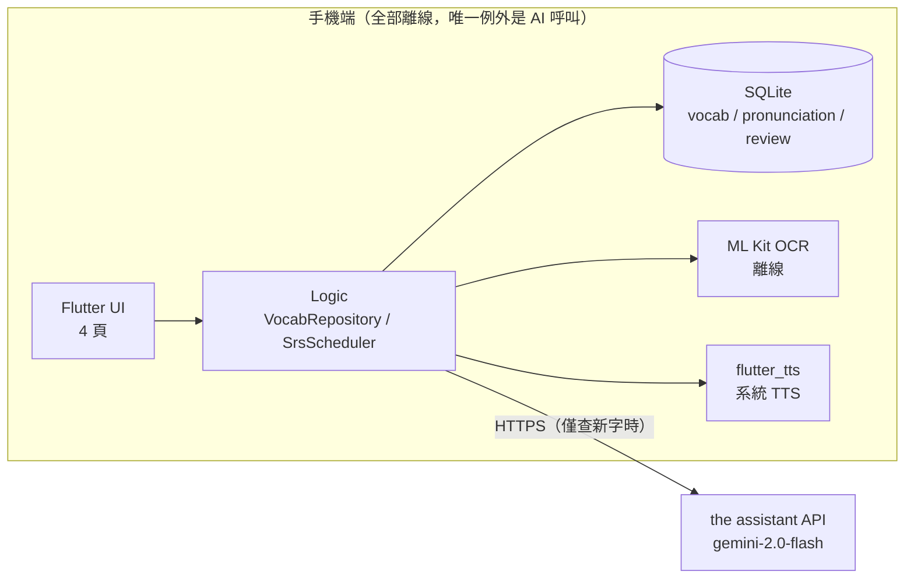
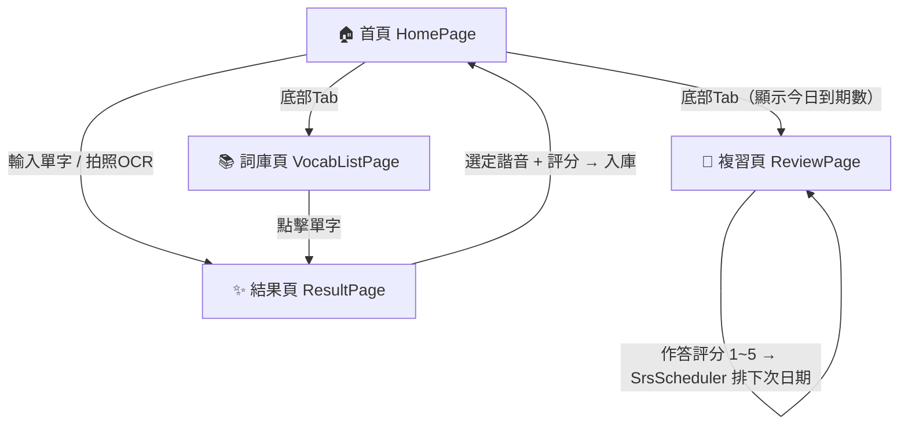
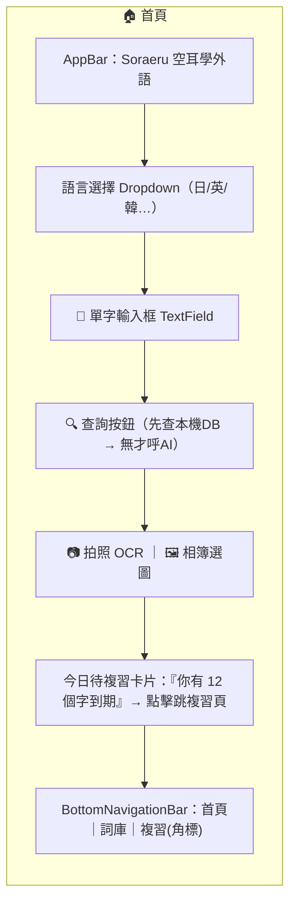
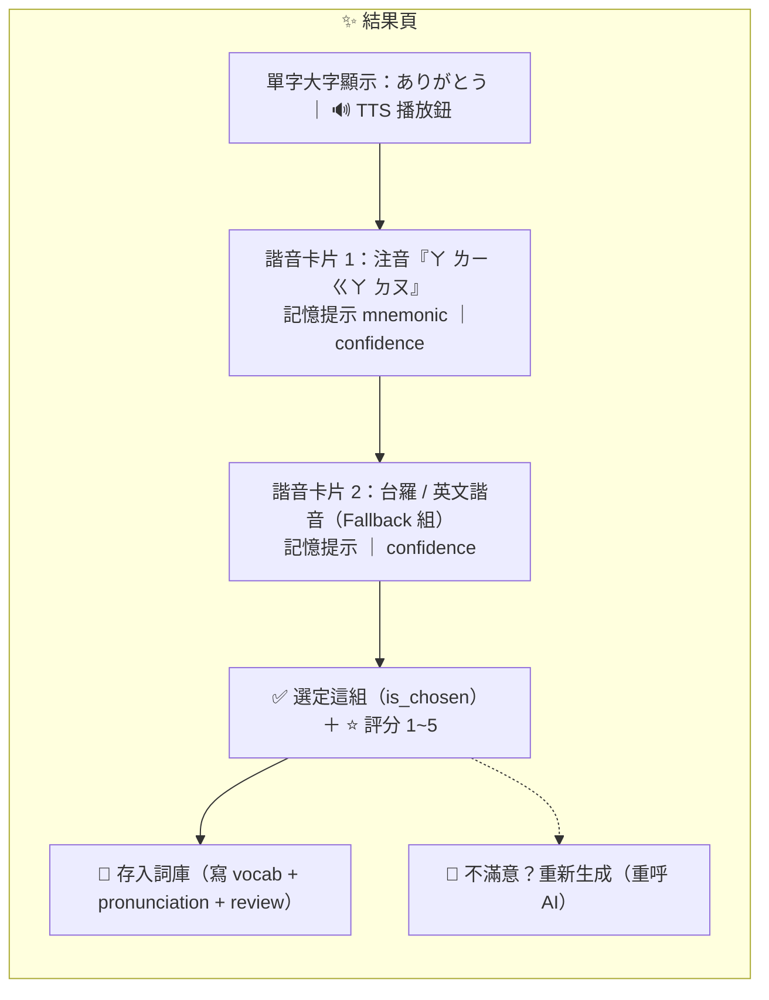
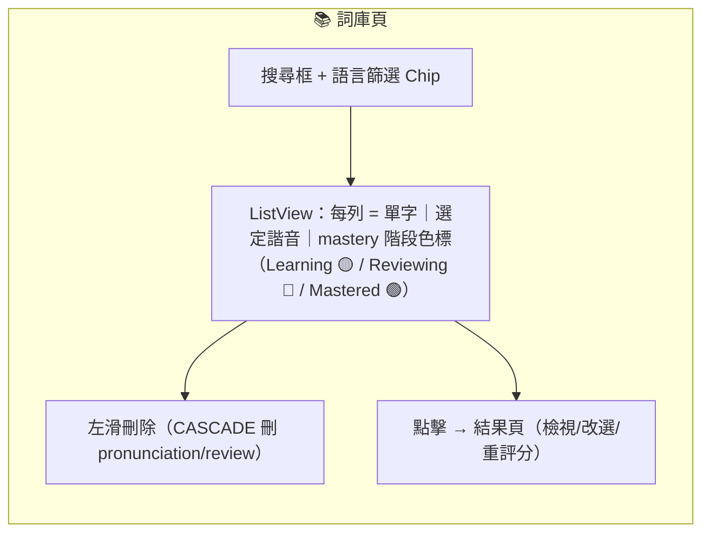
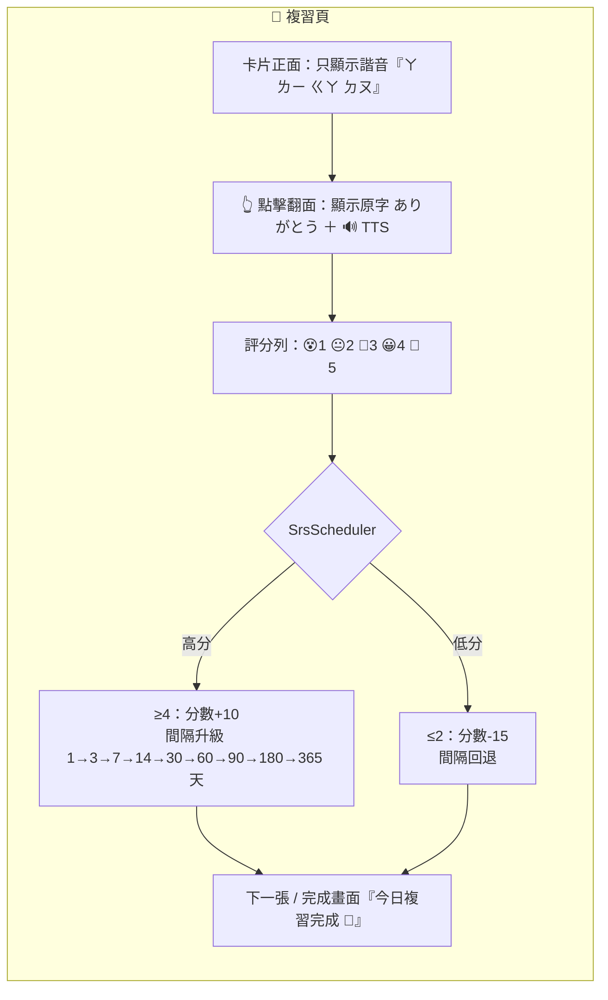
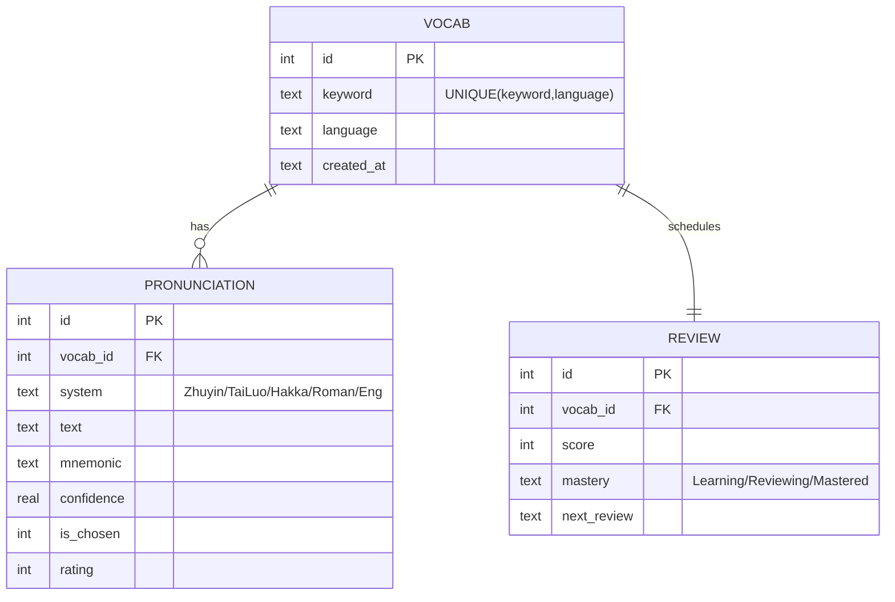

# 空耳外語學習 APP「Soraeru」MVP 規劃書（重整版）

> 版本：v2.1｜日期：2026-08-06｜定位：一人開發、可上架 Google Play 的小型 APP

---

## 1. 產品定位

| 項目 | 內容 |
|---|---|
| 核心價值 | 台灣人用「空耳」（母語諧音）記外語單字，系統自動生成、自動整理，使用者不必做筆記 |
| MVP 輸入 | 手動輸入單字、拍照/相簿圖片（離線 OCR 取字） |
| 諧音原則 | 每字固定兩種搭配：注音為主，注音搭不上時以台羅/客語/羅馬拼音/英文諧音補位（AI 單次呼叫內建 Fallback） |
| 評分機制 | AI 生成後由使用者自評「像不像、好不好記」（1~5 星），驅動 SRS 排程 |
| 明確排除 | 梗圖生成、動漫梗庫、文章段落解析、任何自建後端（Phase 2 再議） |

---

## 2. 技術架構（已定案，不再變動）

| 層 | 選型 | 版本 |
|---|---|---|
| 框架 | Flutter / Dart | 3.x |
| 本機資料庫 | sqflite | ^2.3.3 |
| OCR | google_mlkit_text_recognition | ^0.13.1 |
| TTS | flutter_tts | ^4.0.2 |
| AI | google_generative_ai | ^0.4.6 |
| 圖片 | image_picker | ^1.1.2 |

---

## 3. 硬體支援列表

### 3.1 目標裝置（使用者端）

| 項目 | 最低需求 | 建議規格 | 備註 |
|---|---|---|---|
| OS | Android 6.0（API 23）綁定底線；產品目標 Android 8.0+ | Android 10+（API 29+） | 現行 csproj `SupportedOSPlatformVersion`=23（Lifecycle／GMS Auth）；Target SDK 依 MAUI／Play 政策 |
| RAM | 2 GB | 4 GB 以上 | ML Kit OCR 模型載入約需 100~200 MB 記憶體 |
| 儲存空間 | 150 MB | 300 MB | APK 約 40~60 MB（含 ML Kit）＋ SQLite 資料增長 |
| CPU | armeabi-v7a | arm64-v8a | 建議只出 arm64 + v7a 兩個 ABI，砍 x86 縮小包 |
| 相機 | 非必要 | 有 | 無相機仍可用相簿選圖或純手動輸入 |
| 網路 | 查新字時需要 | Wi-Fi / 4G | 複習、詞庫瀏覽、OCR、TTS 全部離線可用 |
| TTS 引擎 | Google TTS（系統內建） | — | 首次使用目標語言時，引導使用者下載語音包 |

> **設計原則**：只有「查新字」需要網路，其餘功能全離線 —— 這是低階機也能順跑的關鍵。

### 3.2 開發端

| 項目 | 需求 |
|---|---|
| 開發機 | Windows / macOS，RAM 16 GB（Android Emulator + IDE 同開的下限） |
| 實機測試 | 至少 1 台 Android 實機（建議一台低階機驗證 OCR 效能） |
| 帳號 | Google Play 開發者帳號、Google AI Studio（取 API Key） |

### 3.3 iOS？

MVP 不做。Flutter 程式碼可重用約 95%，但需 Mac + Apple Developer（US$99/年），留待 Phase 2 依 Android 成效決定。

---

## 4. 整體 Cost

### 4.1 一次性成本

| 項目 | 金額 | 備註 |
|---|---|---|
| Google Play 開發者帳號 | **US$25**（約 NT$800） | 終身一次性 |
| 測試用低階實機（可選） | NT$0 ~ 3,000 | 二手機即可；有現成手機則免 |
| 開發工具 | NT$0 | Flutter、Android Studio、VS Code 全免費 |

### 4.2 每月營運成本

| 項目 | 金額 | 說明 |
|---|---|---|
| the assistant API（gemini-2.0-flash） | **NT$0** | 免費額度：15 RPM / 1,500 次/日。單人使用或千人以下小眾 APP 綽綽有餘（每次查字僅 1 次呼叫，且本機去重會先攔截） |
| 後端 / 資料庫 / 主機 | NT$0 | 零後端架構，SQLite 在手機端 |
| OCR / TTS | NT$0 | ML Kit 離線授權免費、系統 TTS 免費 |
| Firebase Crashlytics（可選） | NT$0 | Spark 免費方案 |
| 隱私權政策頁面託管 | NT$0 | GitHub Pages 即可 |

### 4.3 人力成本（一人開發）

| 階段 | 工時 |
|---|---|
| W1-W2：主流程（首頁 → AI → 結果頁 → 入庫） | 2 週 |
| W3：詞庫頁 + 複習頁（SRS） | 1 週 |
| W4：OCR、TTS、細節打磨 | 1 週 |
| W5-W6：封閉測試（Play 規定 12 人/14 天）+ 上架審核 | 2 週 |

**結論：現金支出總計約 NT$800（僅 Play 帳號費），月固定成本 NT$0。** 唯一潛在費用是 APP 爆紅後 the assistant 超量，屆時再評估付費層或 App Check + 代理層。

---

## 5. 畫面 Design（Mermaid）

### 5.1 導覽流程（4 頁）

### 5.2 首頁 HomePage（版面配置）

### 5.3 結果頁 ResultPage

### 5.4 詞庫頁 VocabListPage

### 5.5 複習頁 ReviewPage（SRS 主循環）

---

## 6. 資料模型（回顧，不變）

---

## 7. 上架前檢核（Cost 相關風險提醒）

1. **API Key 保護**：`--dart-define` 只防進 Git，APK 反編譯可抽出。上架前二選一：Firebase App Check（免費）或 Cloud Functions 代理（免費額度內）。**這是唯一可能動到「後端」的例外，需你拍板。**
2. **Play 封閉測試**：個人帳號須 12 位測試者連續 14 天，時程已排入 W5-W6。
3. **Data Safety 申報**：因單字文字會送 the assistant，隱私權政策必寫「使用者輸入之文字將傳送至 Google AI 服務處理」。

---
