# Cursor-MVP App 規劃書｜AI 空耳外語學習

> 文件版本：v1.1｜日期：2026-08-06  
> 產品暫名：Soraeru / 空耳學單字  
> 目標平台：Google Play／Android  
> 文件用途：**範圍凍結、可直接開工的合流規格**  
> 變更摘要：上線前完成帳號；多語自動偵測；補齊靜態 Layout；納入 VS 2026／Stitch／AI Studio 工具鏈；章節標題不加括號說明

---

## 0. 文件讀法與凍結聲明

### 0.1 一句話產品定義

使用者登入後，以**手動輸入單字**或**拍照／相簿 OCR 選字**，經**單一 AI 分析 API**自動判斷來源語言，取得詞義、正式讀音與台灣華語近似音候選；選一個候選後存入與帳號綁定的單字卡，為未來收費制度預留帳戶與額度基礎設施。

### 0.2 開工前必須遵守的砍除項

| 砍除項 | 原因 |
|---|---|
| 多 Agent 編排 | 成本與延遲不可控；改單一 Word Analysis Agent |
| iOS／App Store | 需 Mac 與年費；依 Android 成效再決定 |
| 雲端 OCR／圖片上傳後端 | 隱私與成本；OCR 只用裝置端 |
| 完整 SRS／間隔複習演算法 | 首版只做收藏與查閱；複習屬 Phase 2 |
| 實際金流／訂閱扣款畫面 | 上線前只做帳號＋額度＋方案欄位；收費 UI 屬 Phase 2 |

### 0.3 相對 v1.0 的重要決策變更

| 項目 | v1.0 | v1.1 |
|---|---|---|
| 帳號 | 不上線前不做 | **上線前必須完成** Google＋Email／密碼 |
| 來源語言 | 英／日白名單 | **多語自動偵測**，不鎖白名單 |
| 額度主體 | 匿名裝置 | **登入使用者** |
| 畫面章節 | 先流程再線框 | **先靜態 Layout，再流程** |
| 工具鏈 | 未定 | **以 Visual Studio 2026 為主**＋Stitch／AI Studio 等 |

---

## 目錄

1. 產品定位與 MVP 範圍  
2. 畫面 Layout 設計  
3. 使用者操作與業務流程  
4. 功能需求  
5. 系統架構與元件  
6. AI Agent 設計  
7. 資料設計  
8. API 設計  
9. 開發工具鏈與技術棧  
10. 硬體支援  
11. 資安與隱私  
12. Google Play 上架檢核  
13. 開發時程  
14. 成本與控費  
15. 測試與驗收  
16. 風險、成功指標與後續擴充  
17. 最終交付與開工清單  

---

# 一、產品定位與 MVP 範圍

## 1.1 產品目的

開發可上架 Google Play 的小型語言學習 App。核心不是「只學英美日」，而是：

> 任何外語的**發音** → 轉成台灣華語可記的**空耳近似音** → 加速記憶。

使用者可：

- Google 或 Email／密碼登入  
- 手動輸入外語單字／短語  
- 拍照或從相簿選圖，於手機端 OCR  

取得：

- 自動偵測之來源語言  
- 繁體中文詞義  
- 正式讀音文字  
- 正式發音播放  
- AI 產生之台灣華語近似音候選  

並將結果存入帳號綁定之單字卡。

## 1.2 核心價值

系統自動產生「單字＋詞義＋讀音＋空耳＋記憶提示」初稿；使用者只需判斷像不像、好不好記、要不要存。帳號用於額度、資料歸屬與未來收費。

## 1.3 納入功能

| 編號 | 功能 | 必要 |
|---|---|---:|
| F01 | 手動輸入單字 | ✓ |
| F02 | 相機拍照 | ✓ |
| F03 | 相簿選圖 | ✓ |
| F04 | 裝置端 OCR | ✓ |
| F05 | OCR 文字校正與選字，每次一個 | ✓ |
| F06 | **多語自動偵測與分析** | ✓ |
| F07 | 繁體中文詞義 | ✓ |
| F08 | 正式讀音文字 | ✓ |
| F09 | 播放正式發音 | ✓ |
| F10 | AI 產生 2～3 個近似音候選 | ✓ |
| F11 | 注音／羅馬拼音／混合標記 | ✓ |
| F12 | 選擇候選並儲存單字卡 | ✓ |
| F13 | 單字卡列表、搜尋、語言篩選、刪除 | ✓ |
| F14 | 查重：使用者＋語言＋正規化字串 | ✓ |
| F15 | **登入使用者每日 AI 額度** | ✓ |
| F16 | 隱私權政策與 AI 內容聲明 | ✓ |
| F17 | 首次使用說明 | ✓ |
| F18 | **Google 登入** | ✓ |
| F19 | **Email／密碼註冊、登入、重設密碼** | ✓ |
| F20 | **帳號設定：登出、查看額度、未來方案欄位預留** | ✓ |

## 1.4 首版支援矩陣

| 項目 | MVP |
|---|---|
| 平台 | Android only |
| 上架 | Google Play |
| App 介面語言 | 台灣繁體中文 |
| 來源語言 | **自動偵測，不鎖白名單**；常見如英、日、韓、泰、菲他加祿、越、法、德、西等皆可嘗試 |
| OCR | 裝置端優先；腳本不支援時引導改手動輸入 |
| 發音 | 系統 TTS；無語音包則只顯示讀音文字並引導安裝 |
| 帳號 | Google＋Email／密碼 |
| 單字卡 | 本機快取＋雲端歸屬於帳號 |
| AI | 自有 API → LLM |
| 收費扣款 | 不做實際金流；資料模型預留方案欄位 |

## 1.5 多語策略

本 App 重點是「發音→空耳」，因此**不以英日為產品上限**。

| 層級 | 作法 |
|---|---|
| 輸入 | 接受任意 Unicode 單字／短語；使用者可覆寫語言 |
| 偵測 | AI／後端自動回傳 `sourceLanguage` |
| OCR | 裝置端盡力辨識；失敗則手動輸入，不強制上傳圖片 |
| TTS | 依偵測語系請求系統語音；失敗仍顯示 `readingText` |
| 品質聲明 | 商店與結果頁註明：不同語言空耳品質可能不均，可重產或手改 |
| 風險控管 | 不以「官方支援 XX 語」對個別語系做品質保證；以自動偵測＋可重試為準 |

## 1.6 不做

- 梗圖／迷因／AI 生圖  
- 文章、PDF、批次匯入  
- 動漫新番爬蟲  
- 社群、排行榜、分享牆  
- 使用者錄音與發音評分  
- 完整 SRS  
- 多 Agent 編排  
- iOS  
- 實際訂閱金流／Google Play Billing  
- 管理後台、Redis、K8s、自建 GPU  

---

# 二、畫面 Layout 設計

> 本章先定義**靜態畫面結構**，再開工流程。單位為一般直式手機安全區；實作時可對應 MAUI／Flutter 佈局。

## 2.1 全域 Layout 規則

```
┌────────────────────────────┐
│ 系統狀態列                  │  ← OS
├────────────────────────────┤
│ AppBar：標題｜右側次要動作   │  ← 固定高
├────────────────────────────┤
│                            │
│  Content 區                │  ← 可捲動
│  （主內容、表單、列表）       │
│                            │
├────────────────────────────┤
│ Primary CTA／Bottom Bar    │  ← 固定底（有則顯示）
└────────────────────────────┘
```

| 規則 | 說明 |
|---|---|
| 主按鈕 | 每頁最多一個實心 Primary |
| 次按鈕 | 文字鍵或線框鍵 |
| 空耳警示 | 結果頁必須可見，不可只藏在設定 |
| 額度 | 登入後於首頁／設定可見「今日剩餘次數」 |
| 語系 | 輸入頁提供「自動偵測」為預設，可手動覆寫 |

## 2.2 畫面清單

| 代碼 | 畫面 | 需登入 |
|---|---|---:|
| L00 | Splash | 否 |
| L01 | 登入 | 否 |
| L02 | Email 註冊 | 否 |
| L03 | 忘記密碼 | 否 |
| L04 | 首次使用說明 | 是 |
| L05 | 首頁 | 是 |
| L06 | 單字輸入 | 是 |
| L07 | 圖片選擇 | 是 |
| L08 | OCR 選字 | 是 |
| L09 | 分析中 | 是 |
| L10 | 分析結果 | 是 |
| L11 | 我的單字卡 | 是 |
| L12 | 單字卡詳細 | 是 |
| L13 | 設定／帳號 | 是 |

---

## 2.3 L00 Splash

```
┌────────────────────────────┐
│                            │
│                            │
│         [ App Icon ]       │
│       空耳學單字            │
│    用發音，記住外語         │
│                            │
│         ◌ 載入中…          │
│                            │
└────────────────────────────┘
```

| 區塊 | 內容 |
|---|---|
| 置中品牌 | Icon＋名稱＋一句標語 |
| 行為 | 有有效 Session → 首頁；否則 → 登入 |

---

## 2.4 L01 登入

```
┌────────────────────────────┐
│                            │
│       [ App Icon ]         │
│       空耳學單字            │
│  登入後同步單字卡與使用額度  │
│                            │
│  ┌──────────────────────┐  │
│  │ Email                │  │
│  └──────────────────────┘  │
│  ┌──────────────────────┐  │
│  │ 密碼           [顯示] │  │
│  └──────────────────────┘  │
│                            │
│  [        登入        ]    │  ← Primary
│  忘記密碼？                 │
│                            │
│  ────── 或 ──────          │
│  [  使用 Google 登入  ]    │  ← Secondary
│                            │
│  還沒有帳號？註冊           │
│  隱私權政策                 │
└────────────────────────────┘
```

| 元件 | 行為 |
|---|---|
| Email／密碼 | 必填驗證 |
| 登入 | 成功進首次說明或首頁 |
| Google | OAuth → 建立／綁定帳號 |
| 註冊／忘記密碼／隱私權 | 導頁或外開 |

---

## 2.5 L02 Email 註冊

```
┌────────────────────────────┐
│ ← 返回                      │
│ 建立帳號                    │
│                            │
│  ┌──────────────────────┐  │
│  │ 顯示名稱（選填）       │  │
│  └──────────────────────┘  │
│  ┌──────────────────────┐  │
│  │ Email                │  │
│  └──────────────────────┘  │
│  ┌──────────────────────┐  │
│  │ 密碼（至少 8 碼）     │  │
│  └──────────────────────┘  │
│  ┌──────────────────────┐  │
│  │ 確認密碼             │  │
│  └──────────────────────┘  │
│                            │
│  ☐ 我已閱讀隱私權政策       │
│                            │
│  [       建立帳號      ]   │
└────────────────────────────┘
```

---

## 2.6 L03 忘記密碼

```
┌────────────────────────────┐
│ ← 返回                      │
│ 重設密碼                    │
│                            │
│ 輸入註冊 Email，我們會寄送   │
│ 重設連結。                  │
│                            │
│  ┌──────────────────────┐  │
│  │ Email                │  │
│  └──────────────────────┘  │
│                            │
│  [     寄送重設郵件     ]   │
│                            │
│  返回登入                   │
└────────────────────────────┘
```

---

## 2.7 L04 首次使用說明

```
┌────────────────────────────┐
│                            │
│       歡迎使用空耳學單字     │
│                            │
│  1. 輸入或拍照取得外語單字   │
│  2. AI 自動判斷語言並產空耳  │
│  3. 選一個好記的近似音收藏   │
│                            │
│  ┌──────────────────────┐  │
│  │ ⚠ 近似音僅供記憶     │  │
│  │   請以正式發音為準     │  │
│  │ 📷 圖片只在手機辨識   │  │
│  │   不會上傳原圖         │  │
│  └──────────────────────┘  │
│                            │
│  [       開始使用      ]   │
└────────────────────────────┘
```

僅首次登入顯示；設定內可再查看。

---

## 2.8 L05 首頁

```
┌────────────────────────────┐
│ 空耳學單字          [⚙設定] │
├────────────────────────────┤
│ 今日剩餘 AI 次數：12        │
│                            │
│ 用發音記住外語單字           │
│ 支援多語自動偵測             │
│                            │
│  ┌──────────────────────┐  │
│  │                      │  │
│  │    ⌨ 輸入單字         │  │  ← 主 CTA 大卡片
│  │                      │  │
│  └──────────────────────┘  │
│                            │
│  ┌──────────────────────┐  │
│  │ 📷 拍照／選擇圖片    │  │
│  │    僅手機端 OCR       │  │
│  └──────────────────────┘  │
│                            │
│  ┌──────────────────────┐  │
│  │ 📚 我的單字卡         │  │
│  └──────────────────────┘  │
│                            │
│  AI 近似音僅供記憶           │
└────────────────────────────┘
```

| 區塊 | 說明 |
|---|---|
| 頂列 | 標題＋設定 |
| 額度列 | 今日剩餘次數 |
| 三入口 | 輸入／圖片／單字卡；輸入為最大主按鈕 |
| 底聲明 | 固定一行警示 |

---

## 2.9 L06 單字輸入

```
┌────────────────────────────┐
│ ← 返回          輸入單字    │
├────────────────────────────┤
│ 單字或短語                   │
│  ┌──────────────────────┐  │
│  │ 例：ขอบคุณ / salamat  │  │
│  │     / ありがとう      │  │
│  └──────────────────────┘  │
│  字數 0／50                 │
│                            │
│ 來源語言                     │
│  ┌──────────────────────┐  │
│  │ 自動偵測           ▾ │  │
│  └──────────────────────┘  │
│  ※ 可改為指定語言；不確定請留自動 │
│                            │
│ 標記偏好                     │
│  ( ● 注音  ○ 羅馬  ○ 混合 ) │
│                            │
│ 只支援單字或簡短詞組          │
│                            │
├────────────────────────────┤
│ [       開始分析       ]   │
└────────────────────────────┘
```

| 元件 | 規則 |
|---|---|
| 輸入框 | ≤50 Unicode；禁止純空白 |
| 來源語言 | 預設自動偵測；下拉可選常見語或「其他／自動」 |
| 標記偏好 | 套用至候選輸出 |
| 開始分析 | 呼叫 API |

---

## 2.10 L07 圖片選擇

```
┌────────────────────────────┐
│ ← 返回          圖片取字    │
├────────────────────────────┤
│                            │
│  ┌──────────────────────┐  │
│  │                      │  │
│  │     圖片預覽區        │  │
│  │   （未選圖時示意）     │  │
│  │                      │  │
│  └──────────────────────┘  │
│                            │
│  [ 📷 拍照 ]  [ 🖼 相簿 ]  │
│                            │
│  ┌──────────────────────┐  │
│  │ 圖片僅在手機端辨識，  │  │
│  │ 不會上傳至伺服器。    │  │
│  └──────────────────────┘  │
│                            │
├────────────────────────────┤
│ [       開始辨識       ]   │
└────────────────────────────┘
```

---

## 2.11 L08 OCR 選字

```
┌────────────────────────────┐
│ ← 返回          選擇單字    │
├────────────────────────────┤
│ ┌────┐  縮圖               │
│ │img │  可返回重選圖         │
│ └────┘                      │
│                            │
│ 辨識文字（可編輯）            │
│  ┌──────────────────────┐  │
│  │ 整段 OCR 結果…        │  │
│  └──────────────────────┘  │
│                            │
│ 點選要分析的單字（單選）      │
│  ┌──────────────────────┐  │
│  │ ● 詞 A               │  │
│  │ ○ 詞 B               │  │
│  │ ○ 詞 C               │  │
│  └──────────────────────┘  │
│  ＋ 手動輸入其他單字         │
│                            │
│ 已選擇 1 個單字              │
├────────────────────────────┤
│ [     分析選定單字     ]   │
└────────────────────────────┘
```

---

## 2.12 L09 分析中

```
┌────────────────────────────┐
│                            │
│       正在分析單字           │
│         สวัสดี              │
│                            │
│         ◌ 請稍候            │
│                            │
│  ✓ 偵測來源語言              │
│  ✓ 整理詞義及讀音            │
│  ○ 產生近似音候選            │
│                            │
│         [ 取消 ]            │
└────────────────────────────┘
```

步驟為等待體驗；後端為單一 API。

---

## 2.13 L10 分析結果

```
┌────────────────────────────┐
│ ← 返回          分析結果    │
├────────────────────────────┤
│ สวัสดี                      │
│ 泰語 · th-TH                │
│                            │
│ 詞義：你好                  │
│ 正式讀音：sa-wat-dee        │
│ [ ▶ 播放正式發音 ]          │
│                            │
│ ┌────────────────────────┐ │
│ │ ⚠ 以下近似音僅供記憶   │ │
│ │   請以正式發音為準      │ │
│ └────────────────────────┘ │
│                            │
│ ○ 候選 1                   │
│   薩瓦地                   │
│   注音：ㄙㄚ ㄨㄚˇ ㄉㄧˋ    │
│   提示：把音節拆開記         │
│                            │
│ ● 候選 2   ← 已選           │
│   …                        │
│                            │
│ ○ 候選 3                   │
│   …                        │
│                            │
├────────────────────────────┤
│ [重新產生] [ 儲存單字卡 ]   │
└────────────────────────────┘
```

| 規則 | 說明 |
|---|---|
| TTS | 只播正式原文 |
| 儲存 | 至少選一候選 |
| 重產 | 計入每日額度；同字最多 3 次 |
| 語言列 | 顯示偵測結果；可提示「語言不對？返回修改」 |

---

## 2.14 L11 我的單字卡

```
┌────────────────────────────┐
│ ← 返回        我的單字卡    │
├────────────────────────────┤
│ 🔍 搜尋單字…                │
│ [全部] [英] [日] [泰] [其他] │
│                            │
│ ┌────────────────────────┐ │
│ │ สวัสดี                 │ │
│ │ 你好｜薩瓦地｜泰語       │ │
│ └────────────────────────┘ │
│ ┌────────────────────────┐ │
│ │ salamat                │ │
│ │ 謝謝｜沙拉馬｜菲        │ │
│ └────────────────────────┘ │
│                            │
│ （空狀態）                   │
│ 還沒有單字卡                 │
│ [去輸入第一個字]             │
└────────────────────────────┘
```

左滑或詳情內可刪除。篩選 chips 依使用者實際收藏語言動態產生。

---

## 2.15 L12 單字卡詳細

```
┌────────────────────────────┐
│ ← 返回          單字卡      │
├────────────────────────────┤
│ สวัสดี                      │
│ 來源語言：泰語               │
│                            │
│ 詞義：你好                  │
│ 正式讀音：sa-wat-dee        │
│ [ ▶ 播放正式發音 ]          │
│                            │
│ ── 我的近似音 ──            │
│ 薩瓦地                      │
│ 注音：ㄙㄚ ㄨㄚˇ ㄉㄧˋ       │
│ 記憶提示：…                 │
│                            │
│ 建立時間：2026-08-06        │
│                            │
│ [        刪除單字卡      ] │
└────────────────────────────┘
```

---

## 2.16 L13 設定／帳號

```
┌────────────────────────────┐
│ ← 返回            設定      │
├────────────────────────────┤
│ 帳號                        │
│  名稱：Ashton               │
│  Email：a***@gmail.com     │
│  登入方式：Google / Email   │
│                            │
│ 使用額度                     │
│  今日剩餘：12／20            │
│  方案：Free                 │
│  （付費方案即將推出）         │
│                            │
│ 標記偏好預設                 │
│  ( ● 注音  ○ 羅馬  ○ 混合 ) │
│                            │
│ 關於                        │
│  再次查看使用說明            │
│  隱私權政策                  │
│  版本 1.0.0                 │
│                            │
│ [         登出         ]   │
└────────────────────────────┘
```

`方案：Free` 為收費預留，MVP 不接 Billing。

---

## 2.17 靜態畫面關聯概覽

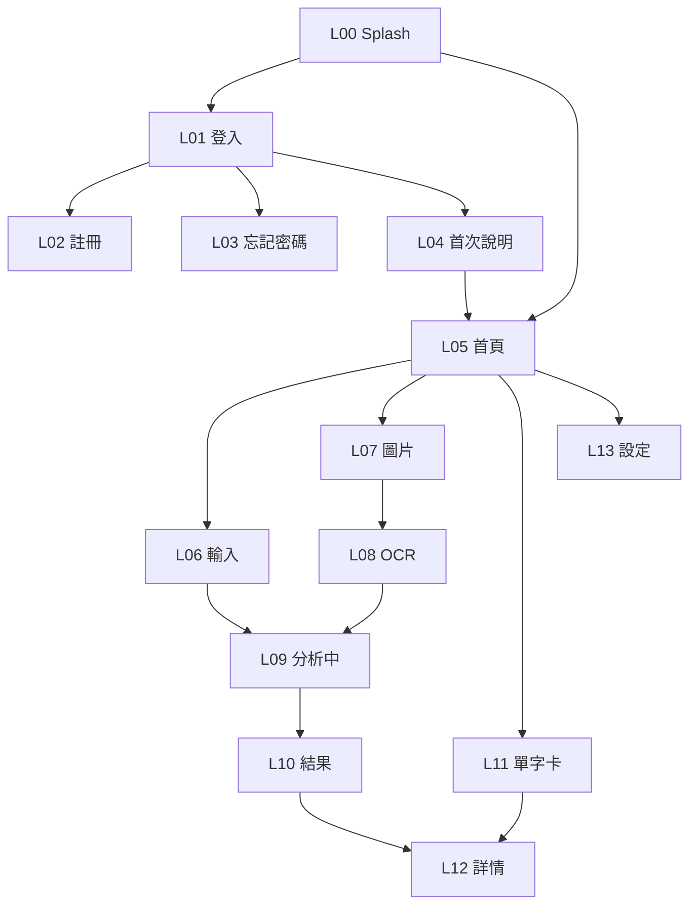

---

# 三、使用者操作與業務流程

## 3.1 整體業務流程

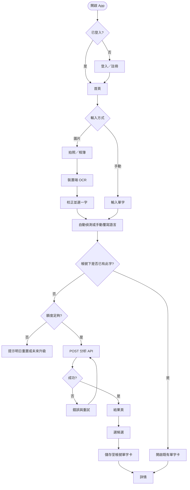

## 3.2 圖片隱私原則

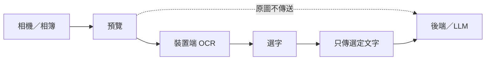

## 3.3 User Flow

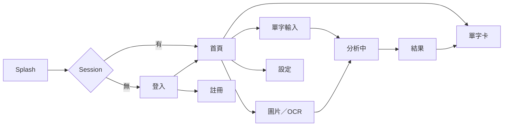

## 3.4 使用案例

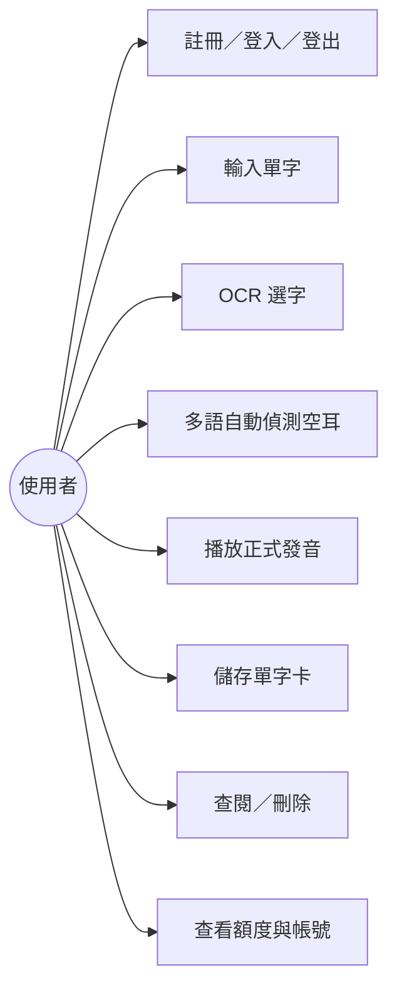

## 3.5 狀態轉移

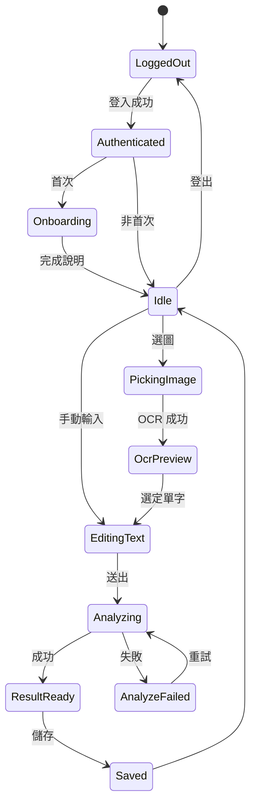

## 3.6 循序圖｜登入後文字分析

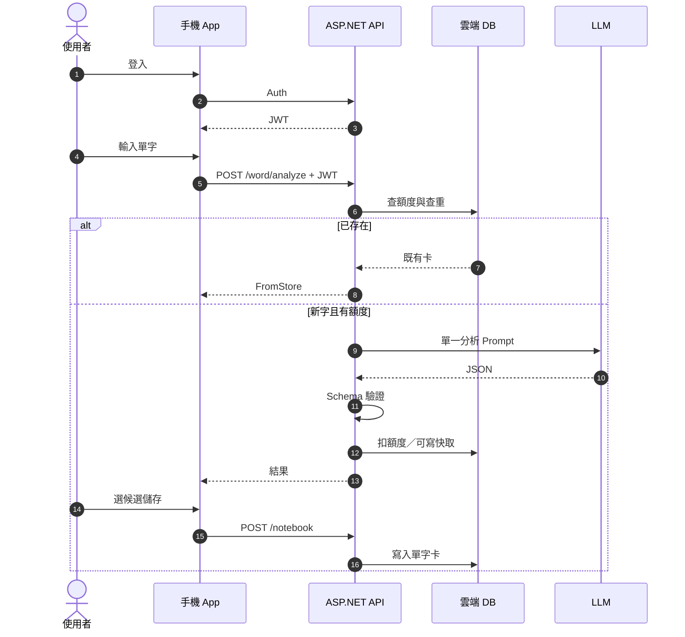

---

# 四、功能需求

## 4.1 帳號

| 項目 | 規則 |
|---|---|
| Google 登入 | 必要；取得基本 email／顯示名 |
| Email／密碼 | 註冊、登入、重設密碼 |
| Session | JWT 或同等；到期需重登 |
| 登出 | 清除本機 Token |
| 收費預留 | `PlanTier`、`DailyQuota` 欄位；MVP 固定 Free |

## 4.2 手動輸入

| 欄位 | 必填 | 規則 |
|---|---:|---|
| 單字／短語 | 是 | ≤50 Unicode |
| 來源語言 | 否 | 預設 `auto`；可手動覆寫 |
| 記憶語言 | 是 | 固定 `zh-TW` |
| 標記偏好 | 是 | 注音／羅馬／混合 |

## 4.3 多語自動偵測

- 後端／AI 回傳 BCP-47 或 ISO 語言碼與可讀名稱  
- 使用者可在輸入頁覆寫語言後重送  
- 不得因「非英日」直接拒絕分析  
- 結果頁顯示偵測語言；不正確可返回修改  

## 4.4 OCR

- JPEG／PNG／WebP；裝置端辨識  
- 每次一字；無結果改手動  
- 原圖不上傳  

## 4.5 AI 結果欄位

`sourceText`、`normalizedText`、`sourceLanguage`、`languageDisplayName`、`meaning`、`readingText`、`mnemonics[2~3]`、`notice`、`remainingDailyQuota`

## 4.6 TTS

- 依 `sourceLanguage` 選語音  
- 無語音包：提示安裝，仍顯示讀音  
- 不播放近似音  

## 4.7 單字卡

- 歸屬使用者；雲端為準，本機可快取  
- 查重：`UserId + SourceLanguage + NormalizedText`  
- 列表搜尋、依語言篩選、刪除  

---

# 五、系統架構與元件

## 5.1 定案架構

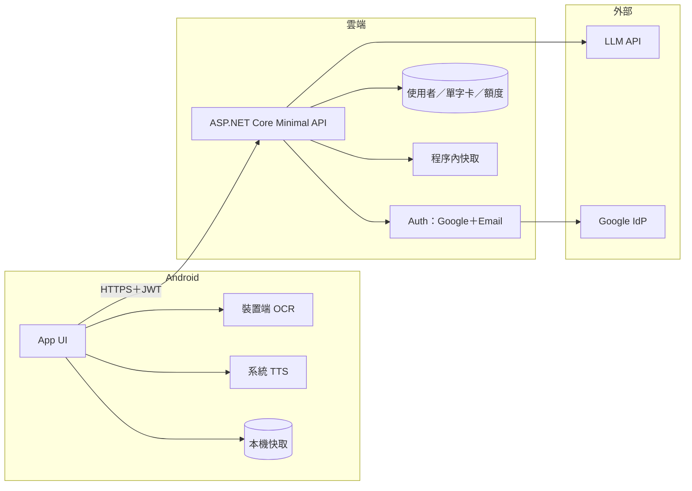

## 5.2 元件責任

| 元件 | 責任 |
|---|---|
| 手機 App | UI、OCR、TTS、Token、本機快取 |
| API | Auth、限流、Prompt、Schema、單字卡 CRUD |
| DB | Users、WordCards、Candidates、UsageDaily |
| LLM | 語言偵測＋詞義＋讀音＋空耳 JSON |

## 5.3 明確不用

Redis 叢集、K8s、多 Agent、圖片 Object Storage、完整 Billing。

## 5.4 部署

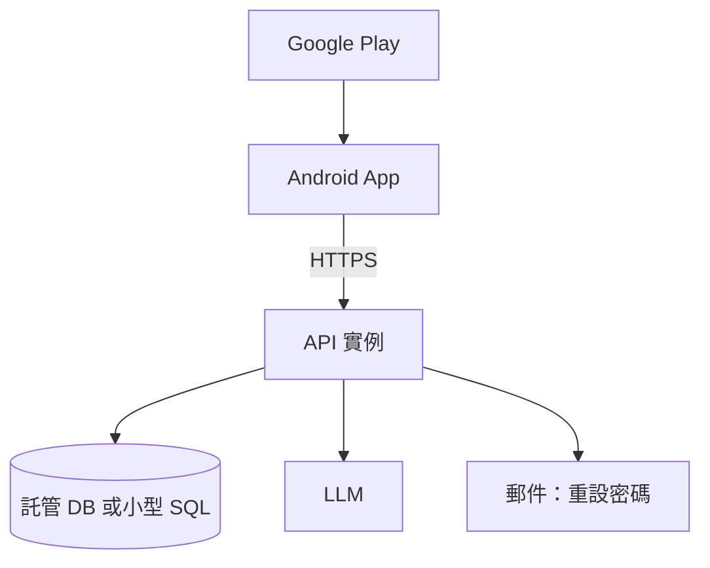

---

# 六、AI Agent 設計

## 6.1 單一 Word Analysis Agent

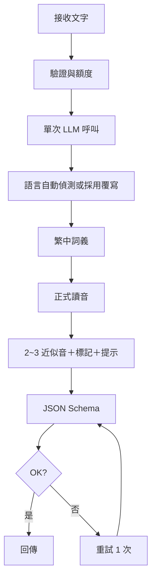

## 6.2 輸出限制

- 只輸出 JSON；候選 2～3  
- 繁中；不產圖；不宣稱為標準發音  
- 無法可靠判斷時回錯誤，不硬掰  
- 語言欄必填，即使信心偏低也要給最佳猜測＋可覆寫指引  

---

# 七、資料設計

## 7.1 ERD

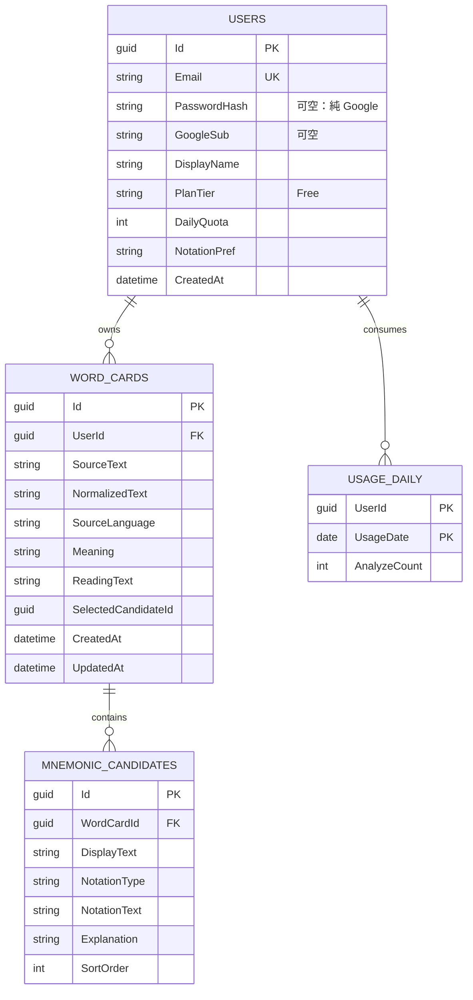

## 7.2 查重

`UserId + SourceLanguage + NormalizedText` 唯一。

## 7.3 收費預留欄位

| 欄位 | MVP 值 | 未來 |
|---|---|---|
| PlanTier | `Free` | `Plus` 等 |
| DailyQuota | 20 | 依方案調整 |
| 不做 | Play Billing 欄位可後加 | Phase 2 |

---

# 八、API 設計

## 8.1 Auth

| Method | Path | 說明 |
|---|---|---|
| POST | `/api/v1/auth/register` | Email 註冊 |
| POST | `/api/v1/auth/login` | Email 登入 |
| POST | `/api/v1/auth/google` | Google idToken 換 JWT |
| POST | `/api/v1/auth/forgot-password` | 寄重設信 |
| POST | `/api/v1/auth/reset-password` | 重設密碼 |
| GET | `/api/v1/me` | 個人資料與剩餘額度 |
| PATCH | `/api/v1/me` | 標記偏好等 |

## 8.2 分析

```http
POST /api/v1/word/analyze
Authorization: Bearer {jwt}
```

### Request

```json
{
  "text": "ขอบคุณ",
  "sourceLanguage": "auto",
  "memoryLanguage": "zh-TW",
  "notationPreference": "bopomofo"
}
```

### Response 200

```json
{
  "sourceText": "ขอบคุณ",
  "normalizedText": "ขอบคุณ",
  "sourceLanguage": "th-TH",
  "languageDisplayName": "泰語",
  "meaning": "謝謝",
  "readingText": "khop-khun",
  "mnemonics": [
    {
      "displayText": "靠昆",
      "notationType": "bopomofo",
      "notationText": "ㄎㄠˋ ㄎㄨㄣ",
      "explanation": "音節對應，方便出口成章"
    }
  ],
  "notice": "近似音僅供記憶，請以正式發音為準。不同語言品質可能有差異。",
  "cached": false,
  "remainingDailyQuota": 12
}
```

## 8.3 單字卡

| Method | Path | 說明 |
|---|---|---|
| GET | `/api/v1/notebook` | 列表／搜尋／語言篩選 |
| GET | `/api/v1/notebook/{id}` | 詳情 |
| POST | `/api/v1/notebook` | 儲存選定候選 |
| DELETE | `/api/v1/notebook/{id}` | 刪除 |

## 8.4 防護

HTTPS、JWT、輸入長度、每使用者日額度、Schema 驗證、Key 不上 App、重試最多 1 次。

---

# 九、開發工具鏈與技術棧

## 9.1 以 Visual Studio 2026 為主的分工

| 工作 | 建議工具 | 說明 |
|---|---|---|
| 方案／後端 API | **Visual Studio 2026** | ASP.NET Core Minimal API、偵錯、發佈 |
| Android App | **Visual Studio 2026 ＋ .NET MAUI** | 與 VS 同生態，建議定案 |
| 若堅持 Flutter | VS 2026 管 API；App 用 Android Studio／VS Code | 雙工具鏈，成本較高 |
| 模擬器／實機／簽名 | Android SDK／裝置管理員 | VS 安裝 Mobile 工作負載 |
| UI 高保真草稿 | **Google Stitch** | 自然語言→畫面；匯出 DESIGN.md／參考給 Cursor |
| Prompt／模型試跑 | **Google AI Studio** | 先驗證多語空耳 JSON，再鎖進 API |
| 後備模型實驗 | OpenAI Platform／其他 Provider Console | 比價與品質對照 |
| 登入與郵件 | Firebase Auth 或 ASP.NET Identity＋SMTP | Google＋Email；重設密碼 |
| 上架 | Google Play Console | AAB、封閉測試、Data Safety |
| API 手動測 | Bruno／Postman／VS http 檔 | 驗 JWT 與 analyze |
| DB | VS SQL／SSMS／SQLite 瀏覽工具 | 看 Users／Notebook |
| 錯誤監控 | Crashlytics 或 App Center | 封閉測試期建議開 |
| 隱私權託管 | GitHub Pages | 靜態頁即可 |
| AI 協助寫碼 | **Cursor** | 依本規劃書實作；可讀 Stitch DESIGN.md |
| 原始碼 | Git＋GitHub／Azure DevOps | VS 內建 |

## 9.2 建議工具流程

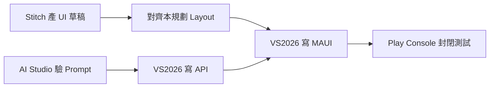

## 9.3 技術棧定案

| 層 | 選型 |
|---|---|
| IDE | Visual Studio 2026 |
| App | **.NET MAUI** Android |
| API | ASP.NET Core 8/9 Minimal API |
| DB | Azure SQL Basic／SQLite 託管等同小型方案 |
| Auth | Google Sign-In＋Email／密碼 |
| OCR | 裝置端（MAUI 綁 ML Kit 或同等套件） |
| TTS | 系統 TextToSpeech |
| LLM | AI Studio 選定之低價文字模型 |
| UI 設計輔助 | Google Stitch |

> 若團隊已有 Flutter 資產，可維持 Flutter Client，但本文件預設 **MAUI＋VS2026** 以符合你的主力 IDE。

## 9.4 Stitch／AI Studio 使用原則

| 工具 | 用來做 | 不要用來做 |
|---|---|---|
| Stitch | L01～L13 視覺迭代、對齊 Layout、DESIGN.md | 直接當唯一規格；範圍仍以本文件為準 |
| AI Studio | 多語 Prompt、JSON Schema、壞案例 | 把 API Key 寫進 App |
| Cursor | 依本文件產 MAUI／API 碼 | 擅自加回砍除項 |

---

# 十、硬體支援

## 10.1 使用者裝置

| 項目 | 最低 | 建議 |
|---|---|---|
| OS | Android 8.0+ | Android 10+ |
| RAM | 3 GB | 4 GB+ |
| 空間 | 200 MB | 300 MB |
| 相機 | 非必要 | 有 |
| 網路 | 分析與登入需要 | Wi-Fi／4G |
| Google Play 服務 | 需要 | Google 登入 |

## 10.2 開發端

| 項目 | 需求 |
|---|---|
| IDE | Visual Studio 2026＋MAUI／Mobile 工作負載 |
| RAM | 建議 16 GB+ |
| 實機 | ≥1 台 Android |
| 帳號 | Play、Google Cloud／Firebase、LLM、AI Studio、Stitch |

---

# 十一、資安與隱私

## 11.1 資料流

| 資料 | 離開手機？ | 說明 |
|---|---:|---|
| 原圖 | 否 | 裝置 OCR |
| 選定文字 | 是 | API → LLM |
| 帳號 | 是 | Auth／DB |
| 單字卡 | 是 | 雲端歸戶；本機快取 |
| 密碼 | 雜湊儲存 | 不明文 |

## 11.2 要求

- LLM Key 不上 App  
- JWT 安全儲存  
- 最小權限：網路、相機、相片  
- 隱私權與 Data Safety 一致  
- 明文告知文字送 AI、多語品質可能不均  

---

# 十二、Google Play 上架檢核

- [ ] 開發者帳號  
- [ ] 套件名、名稱、短述、完整說明  
- [ ] Icon／Feature Graphic／截圖含登入、首頁、結果、單字卡  
- [ ] 隱私權 URL  
- [ ] Data Safety：帳號、文字送 AI、圖片不上傳  
- [ ] 內容分級  
- [ ] AAB＋簽章＋Play App Signing  
- [ ] 封閉測試 12 人×14 天  
- [ ] Key 未進 APK  
- [ ] 聲明：AI 可能有誤、近似音僅供記憶、多語品質不一  
- [ ] 16 KB page size 等現行政策  
- [ ] Crash-free 達標後轉正式軌  

---

# 十三、開發時程

| 週次 | 工作 | 產出 |
|---|---|---|
| W1 | VS2026 方案、Auth、Users、登入／註冊 Layout | 可登入 |
| W2 | Analyze API、AI Studio Prompt、結果 JSON | 文字分析通 |
| W3 | MAUI 首頁／輸入／結果／單字卡雲端 CRUD | 主閉環 |
| W4 | OCR、TTS、多語顯示與覆寫 | 圖片＋多語 |
| W5 | 額度、設定、錯誤態、Stitch 視覺對齊 | 候選 Build |
| W6～W7 | 封閉測試 12×14、修缺陷 | 穩定軌道 |
| W8 | 商店素材、送審 | 上架 |

工時粗估因帳號與多語約 **300～420 小時**。

---

# 十四、成本與控費

## 14.1 現金

| 項目 | 約略 |
|---|---:|
| Play 帳號 | US$25 一次 |
| 網域／隱私權 | 0～1,500 TWD／年 |
| API＋小型 DB | 數百～數千 TWD／月 |
| AI | 視多語用量；需嚴控額度 |
| 郵件 | 無料額／低成本 SMTP |

自研現金預備建議：**2～4 萬 TWD**。

## 14.2 控費

1. 每使用者每日分析上限  
2. 同字重產 ≤3  
3. 帳號內查重命中不打 LLM  
4. 後端快取：語言＋正規化字＋標記＋PromptVer  
5. Provider 預算熔斷  

---

# 十五、測試與驗收

## 15.1 功能

- [ ] Google／Email 註冊登入登出、重設密碼  
- [ ] 英、日、泰、菲等樣本可分析；`auto` 可偵測  
- [ ] 手動覆寫語言生效  
- [ ] OCR 選一字；原圖不上傳  
- [ ] 詞義／讀音／2～3 候選／TTS  
- [ ] 單字卡雲端列表與刪除  
- [ ] 額度用盡提示  
- [ ] Layout 符合第二章結構  

## 15.2 資安

- [ ] 無 LLM Key 於 App  
- [ ] HTTPS＋JWT  
- [ ] 密碼非明文  
- [ ] 不傳原圖  

## 15.3 上架

- [ ] 封閉測試完成  
- [ ] Data Safety 一致  
- [ ] 無阻擋級 Crash  

---

# 十六、風險、成功指標與後續擴充

## 16.1 風險

| 風險 | 對策 |
|---|---|
| 多語空耳品質不均 | 聲明＋重產＋手動覆寫語言 |
| OCR 對部分文字系統差 | 手動輸入為一等公民 |
| TTS 缺語音包 | 讀音文字＋安裝引導 |
| 帳號／郵件複雜度 | Identity／Firebase 現成方案 |
| AI 費用 | 額度＋快取＋熔斷 |
| 過早做金流 | 只預留欄位，Billing 放 Phase 2 |

## 16.2 成功指標

| 指標 | 目標 |
|---|---|
| 登入成功率 | ≥ 98% |
| 生成成功率 | ≥ 95% |
| 生成後收藏率 | ≥ 40% |
| 文字路徑 P95 | ＜ 8 秒 |
| Crash-free | ≥ 99% |

## 16.3 後續

**Phase 2**：Play Billing、方案升級頁、輕量 SRS、自訂近似音、雲端完整衝突合併  
**Phase 3**：錄音評分、文章輸入、社群、iOS  

---

# 十七、最終交付與開工清單

## 17.1 交付物

- VS2026 Solution：MAUI App＋ASP.NET API  
- DB migration  
- Prompt＋JSON Schema  
- Stitch／DESIGN.md 參考（可選）  
- 隱私權、Play 素材、測試紀錄  

## 17.2 開工順序

| 順序 | 交付物 |
|---|---|
| 1 | Auth＋L01～L03 Layout |
| 2 | Users／UsageDaily／JWT |
| 3 | AI Studio 多語 Prompt 定稿 |
| 4 | `/word/analyze`＋L06／L09／L10 |
| 5 | Notebook API＋L11／L12 |
| 6 | OCR L07／L08＋TTS |
| 7 | L05／L13 額度與設定 |
| 8 | Stitch 視覺對齊＋封閉測試＋送審 |

## 17.3 定案結論

```text
Visual Studio 2026
＋ .NET MAUI Android
＋ ASP.NET Core Minimal API
＋ Google 登入＋Email／密碼
＋ 多語自動偵測空耳
＋ 裝置端 OCR（圖不上雲）
＋ 系統 TTS
＋ 帳號綁定單字卡與日額度
＋ 單一 Word Analysis Agent
＋ Stitch／AI Studio 輔助設計與 Prompt
＋ 無多 Agent／無 iOS／無完整 SRS／無實際上線金流
```

閉環：

```text
登入 → 輸入或 OCR 選字 → 多語偵測與空耳 → 選候選 → 存入帳號單字卡
```

---

*v1.1 依產品決策更新：帳號必修、多語自動偵測、靜態 Layout 先行、VS2026 工具鏈。*
