# 📱 空耳諧音記憶 APP (MVP 階段) 專案規劃書

本規劃書整合 **軟體技術架構**、**UI 介面原型設計** 與 **財務費用預算**，旨在為發布至 **Google Play Store** 與 **Apple App Store** 的 MVP（最小可行性產品）提供完整的工程開發標準、維運機制與資金規劃。本方案採取技術語言中立（Technology-Agnostic）原則，僅定義架構分層與資料傳輸介面，不指定或限制前端與後端具體的開發語言或框架。

---

## 壹、 專案定位與核心範疇

* **產品定位**：專為語言學習者打造，結合「多軌在地化拼音（注音/台羅/客語/美式 Phonics）」與「AI Agent 自動化擬音」的爆笑極速記憶工具。
* **MVP 核心範疇**：
1. **輕量化輸入**：僅支援「純文字輸入」與「相機/相冊圖片 OCR 識圖」。
2. **AI Agent 分工轉譯**：Vision Agent（識圖）$\rightarrow$ Phonetic Agent（音標與雙軌諧音）$\rightarrow$ QA Agent（擬真度校驗）。
3. **單字卡生成與正音**：顯示主/次要雙軌空耳拼音，對接免費/高性價比 TTS 原音播放。
4. **Anki 間隔重複 (SRS)**：提供個人單字庫收藏與基礎複習功能。
5. **不包含項目**：MVP 階段不包含 AI 迷因梗圖繪製與社群動態牆，以降低算力開銷與開發週期。

---

## 貳、 階段一：需求與範疇 (Requirements & Scope)

### 1. 業務流程圖 (Business Process Flow)

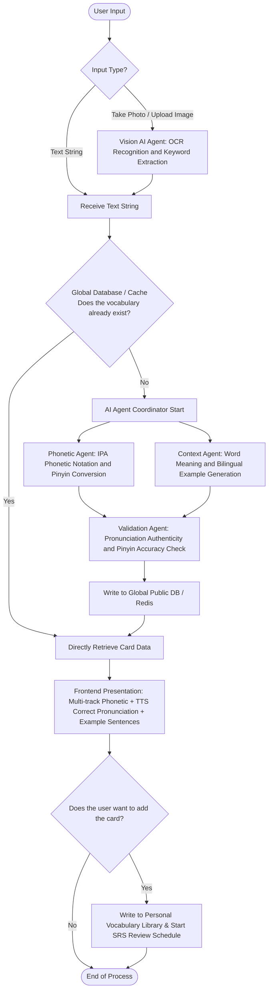

---

### 2. 使用案例圖 (Use Case Diagram)

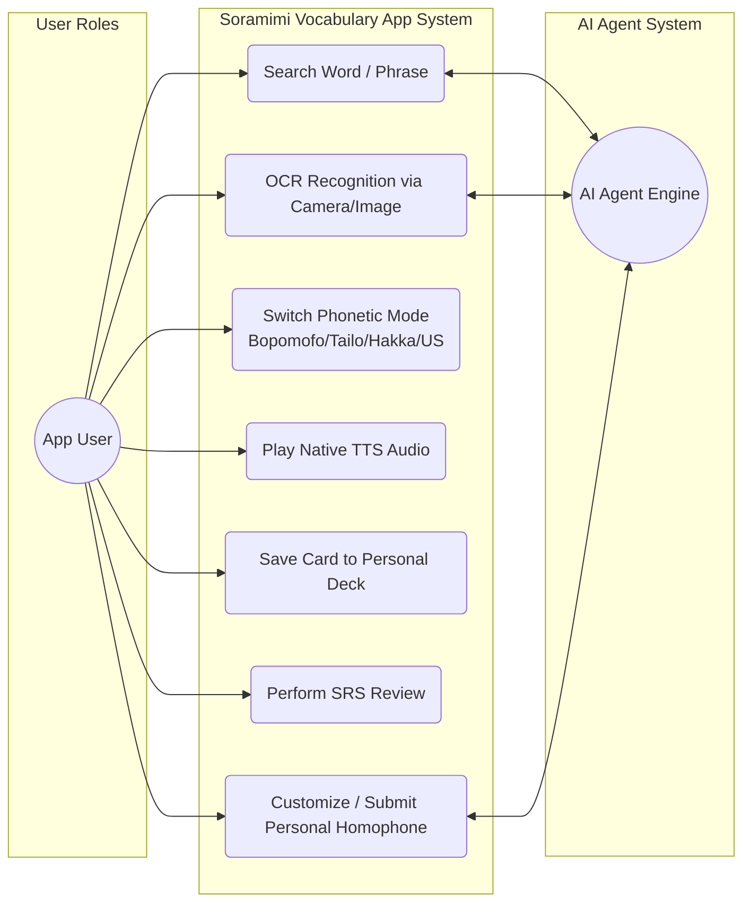

---

### 3. 畫面流程圖 (User Flow)

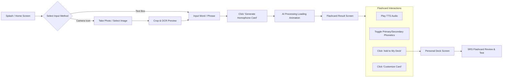

---

### 4. 介面 UI 視覺與原型規劃 (UI Wireframe Designs)

#### A. 主輸入與相機 OCR 畫面 (Home & Input Screen Wireframe)

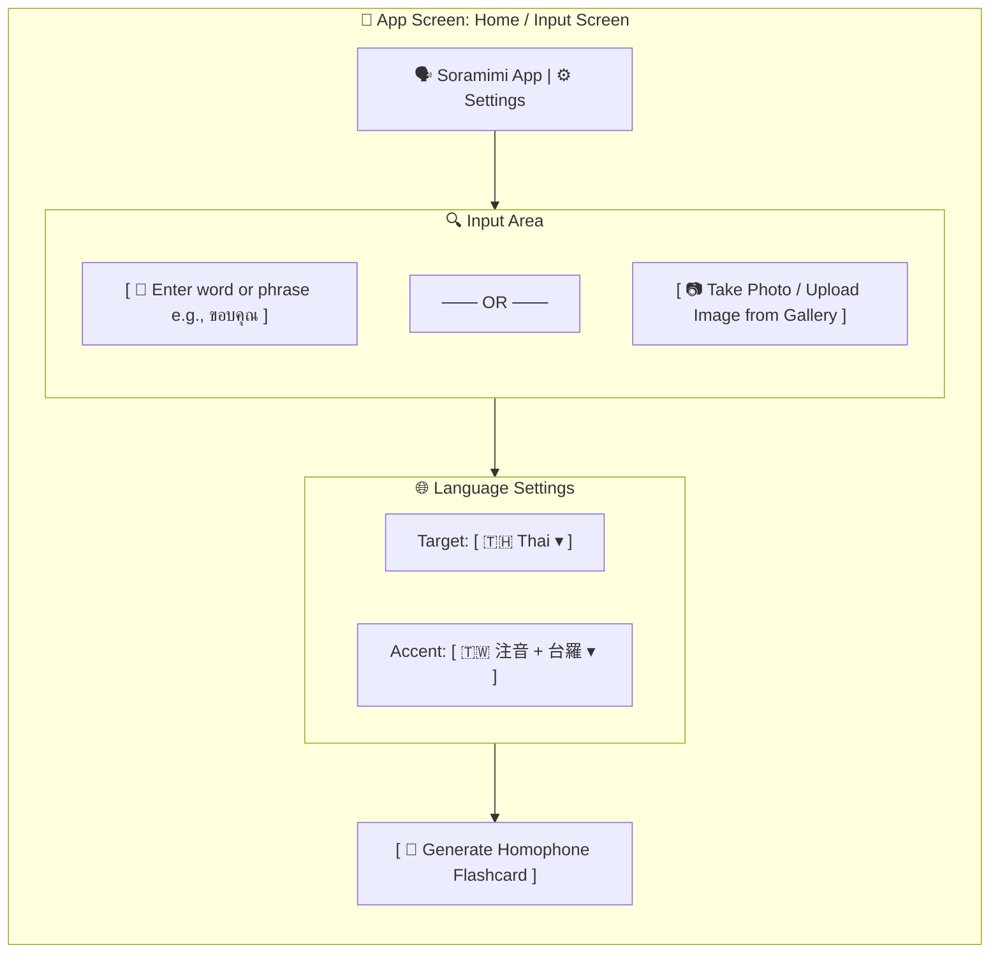

#### B. 空耳單字卡結果畫面 (Flashcard Result Screen Wireframe)

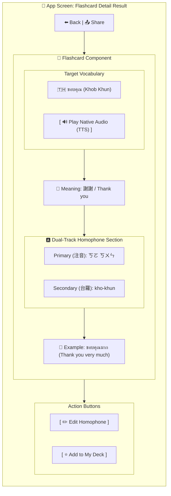

#### C. SRS 單字卡複習測驗畫面 (SRS Review Screen Wireframe)

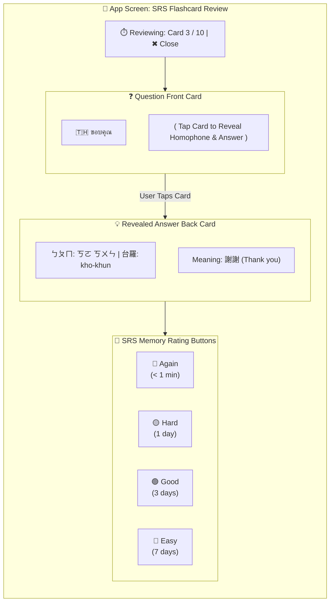

* **設計說明**：
1. **結構化區塊 (Subgraphs)**：利用 Mermaid 的 `subgraph` 模擬手機外框與 UI 組件容器，清楚呈現 UI 元件之階層關係。
2. **UI 符號標記**：透過文本標記（如 `[ 🔍 ]` 代表輸入框、`[ 🔊 ]` 代表按鈕、`[ ▾ ]` 代表下拉選單），在架構面上界定功能區塊。
3. **開發獨立性**：UI 圖表僅展示組件佈局（Component Layout）與狀態切換（State），團隊後續可自由選用適宜的前端 UI 框架實作。

---

## 參、 階段二：總體架構與硬體規劃 (Architecture & Hardware)

### 1. 系統架構圖 (System Architecture Diagram)

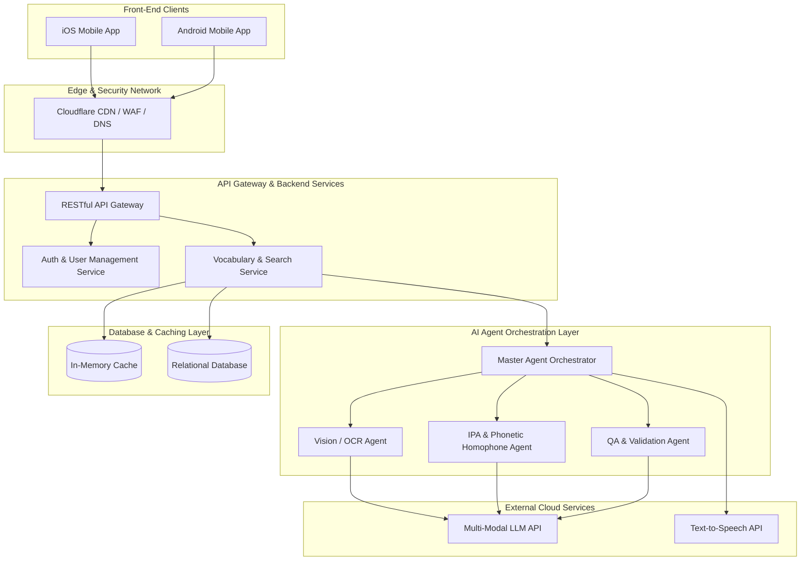

---

### 2. 最小硬體架構規格 (Minimal Hardware Specifications)

為使 MVP 能以最低資本上線，後端採用 **Serverless 無伺服器架構** 或 **輕量容器服務**，無流量時自動縮減至 0 執行個體，初期支援 **1,000 ~ 5,000 MAU**：

* **API 與 Agent 運算層**：無伺服器容器託管平台（GCP Cloud Run / AWS App Runner / Azure Container Apps 等），按秒與請求量計費。
* **主資料庫層**：託管式關聯型資料庫（如 Supabase PostgreSQL / AWS RDS / GCP Cloud SQL 輕量型）。
* **快取記憶體層**：Serverless In-Memory Cache（如 Upstash Redis），按 Request 計費，避免固定主機開銷。
* **暫存儲存空間**：物件儲存服務（AWS S3 / GCP Cloud Storage），設定生命週期 3 天自動清除上傳之辨識圖片。

---

## 肆、 階段三：詳細技術設計 (Detailed Technical Design)

### 1. 實體關聯圖 (ERD)

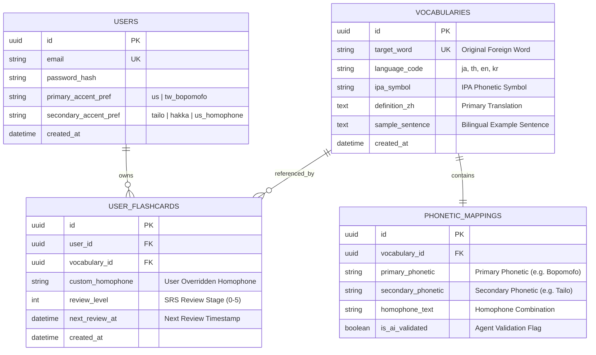

---

### 2. 狀態轉移圖 (State Transition Diagram)

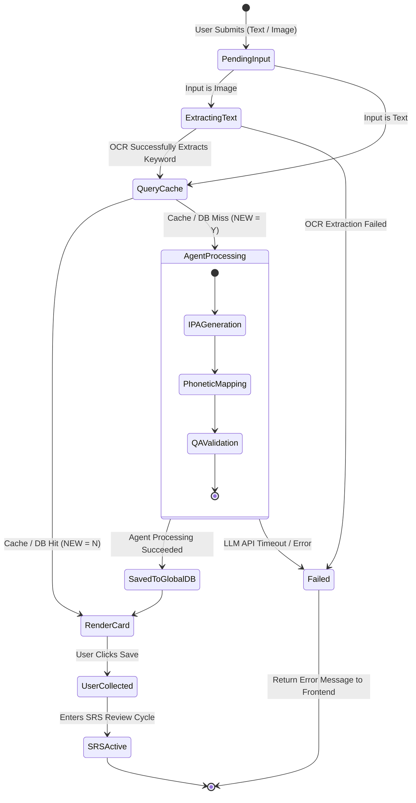

---

### 3. 循序圖 (Sequence Diagram)

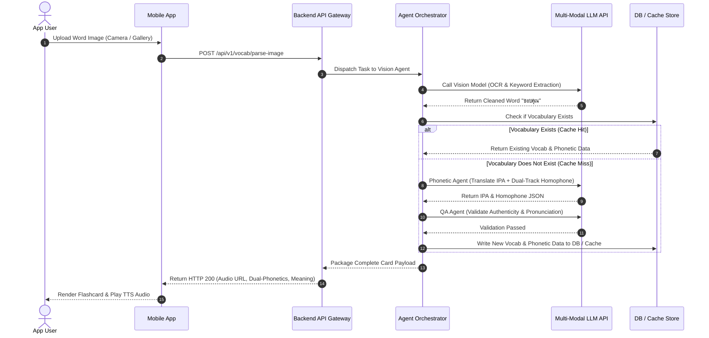

---

## 伍、 階段四：部署維運 (Deployment & Operations)

### 部署圖 (Deployment Diagram)

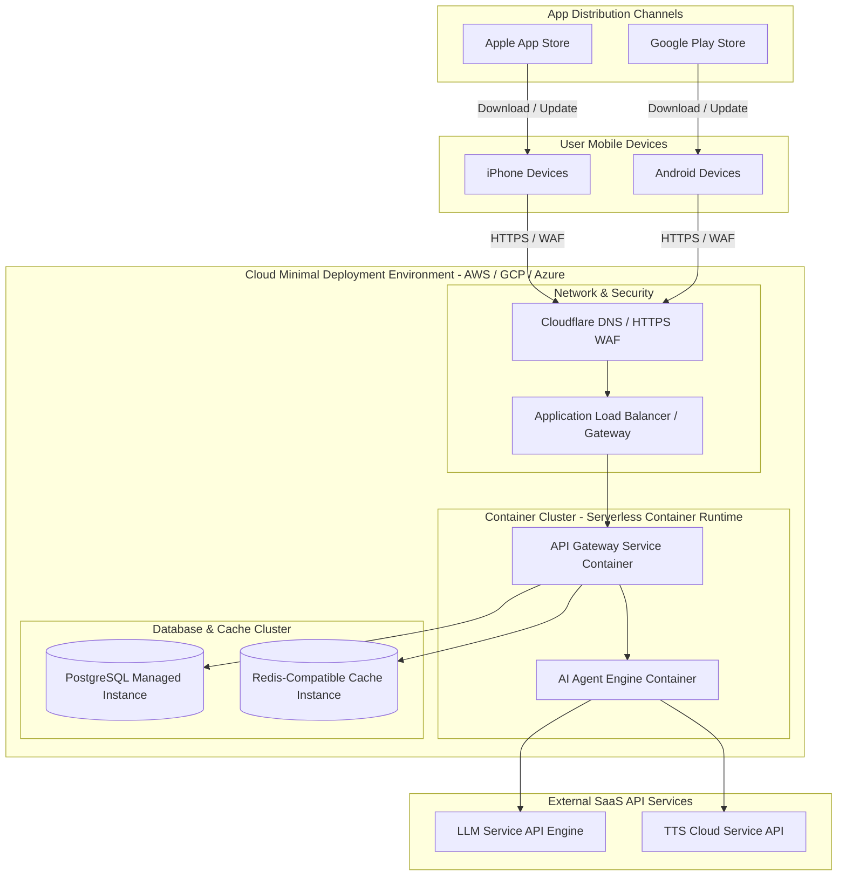

---

## 陸、 階段五：專案費用與預算規劃 (Financial & Budget Plan)

針對 MVP 階段，整體費用分為 **雙平台帳號規費（固定開銷）**、**雲端基建（月維運費）** 與 **AI API 用量費（彈性支出）**。

### 1. 雙平台帳號與上架規費 (固定費用)

| 項目 | 計費方式 | 預估費用 (USD) | 說明 |
| --- | --- | --- | --- |
| **Apple Developer Program** | 年費 | **$99 / 年** | 上架 iOS App Store 必須 |
| **Google Play Console** | 一次性 | **$25 (單次)** | 上架 Android Google Play 必須 |
| **網域與 SSL 憑證 (Domain)** | 年費 | **$10 - $15 / 年** | 用於 API 域名 (如 `api.yourdomain.com`) |
| **小計** | **首年固定** | **約 $134 - $139** | **第二年起約 $109 - $114 / 年** |

---

### 2. 雲端基礎設施費用 (月度固定/半變動)

採用 Serverless / PaaS 微型架構，無流量時自動縮減至零開銷：

| 服務模組 | 建議方案 | 免費額度 (Free Tier) | 預估月費 (5,000 MAU 內) |
| --- | --- | --- | --- |
| **API & Agent 運算** | Cloud Run / App Runner / Container Apps | 每月 200 萬次免費請求 | $0 - $20 / 月 |
| **主資料庫 (PostgreSQL)** | Supabase / Managed RDS | 500 MB 免費資料庫 | $0 - $25 / 月 |
| **快取記憶體 (Redis)** | Upstash Serverless Redis | 每日 10,000 次免費請求 | $0 - $10 / 月 |
| **圖片暫存 (S3/GCS)** | S3 / Cloud Storage | 5 GB 免費儲存空間 | $0 - $5 / 月 |
| **小計** | **月基礎維運** | -- | **約 $0 - $60 / 月** |

---

### 3. AI API 用量變動成本 (Variable API Costs)

具備 **「全域 DB / Redis 快取機制」**，僅有全新單字（NEW = Y）才會消耗 AI API，舊單字查詢成本為 **$0**。

| AI Agent 模組 | 建議模型 / API | 單次呼叫預估單價 | 1,000 次全新單字生成預估 |
| --- | --- | --- | --- |
| **Vision / OCR Agent** | GPT-4o-mini (Vision) / Cloud Vision API | ~$0.001 - $0.003 / 張 | 約 $1.0 - $3.0 |
| **Phonetic & QA Agent** | GPT-4o-mini / Claude 3.5 Haiku | ~$0.0005 - $0.001 / 次 | 約 $0.5 - $1.0 |
| **正音 TTS (Text-to-Speech)** | Edge-TTS (免費) / Google Cloud TTS | 免費 / $0.000004 / 字 | **$0** (若選用 Edge-TTS) |
| **小計** | **單字生成成本** | **約 $0.0015 - $0.004 / 個單字** | **約 $1.5 - $4.0 / 千字** |

> 💡 **快取防護效益**：假設 1,000 名活躍使用者每月查詢 10,000 次單字，其中 80% 為快取命中（NEW = N），僅 2,000 次需要 AI 生成，AI API 總支出每月僅約 **$3 - $8 USD**。

---

### 4. MVP 階段總預算試算 (Budget Scenarios)

#### 階段 A：冷啟動測試期 (0 ~ 500 MAU)

* **平台規費**：$139 USD (首年一次性 + Apple 首年)
* **雲端基建**：$0 USD (全數包含於 Free Tier 額度內)
* **AI API 費**：約 $5 USD / 月
* 👉 **首月總投入金額**：約 **$144 USD**（自第二個月起僅需約 **$5 USD / 月**）

#### 階段 B：初步營運成長期 (1,000 ~ 5,000 MAU)

* **雲端基建**：約 $25 - $50 USD / 月
* **AI API 費**：約 $15 - $40 USD / 月
* 👉 **每月維運總開銷**：約 **$40 - $90 USD / 月**（不含市場行銷推廣費）