# 空耳單字 APP｜MVP 規劃書（Google Play 小型上架）

**文件版本**：v1.1（精簡＋可上架）  
**產品暫名**：KongEar（空耳）  
**目標平台**：Google Play（Android 優先）  
**文件用途**：範圍凍結、成本可控、可直接開工  

---

## 0. 一句話產品定義

使用者輸入**單字**或**圖片（OCR 選字）**，由後端 AI 產生**主空耳 + 備援空耳**，自行挑選後存入生字本；降低自己做筆記的成本。

---

## 1. MVP 範疇

### 1.1 做（In Scope）

| ID | 功能 | 說明 |
|----|------|------|
| F1 | 單字輸入 | 手動輸入外語單字／短語（≤ 40 字） |
| F2 | 圖片輸入 | 相機／相簿 → OCR → 點選要學的字 |
| F3 | 雙軌空耳 | 主軌 3 組 + 次軌 ≥ 1 組 |
| F4 | AI 協作 | 正規化、語言偵測、生成、簡單品管 |
| F5 | DB 查重 | 同語言＋正規化字串不重複建檔 |
| F6 | 生字本 | 收藏、備註、記憶分數 1–5 |
| F7 | Google 登入 | 簡易帳號 |
| F8 | 每日次數上限 | 控制 AI 成本 |
| F9 | 設定 | 主／次空耳系統偏好 |

### 1.2 不做（Out of Scope）

- 梗圖／迷因／AI 生圖  
- 長文、PDF、Word、批次匯入  
- 動漫新番爬蟲專區  
- 社群、排行榜、聊天  
- 完整 SRS 複習演算法  
- iOS 同步上架（可 Phase 2）  
- 自建 GPU／大型微服務  

### 1.3 語言（MVP）

| 項目 | 內容 |
|------|------|
| 來源語言 | 日文、英文（優先） |
| 主空耳 | 中文諧音／注音感（`ZH_HAN`） |
| 次空耳 | 英文近似拼讀（`EN_LIKE`） |
| App 介面 | 繁體中文（台灣） |

---

## 2. 業務流程（精簡）

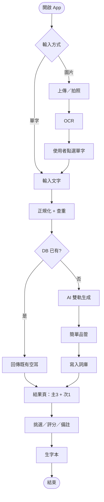

---

## 3. 使用案例

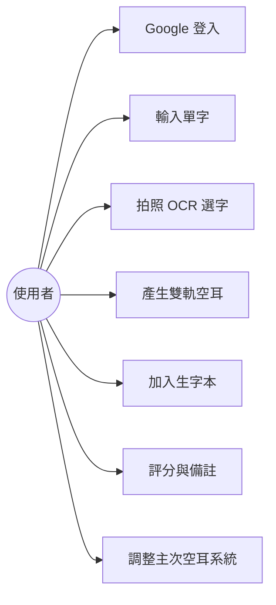

---

## 4. 畫面 Design（User Flow + 線框）

### 4.1 全畫面流程

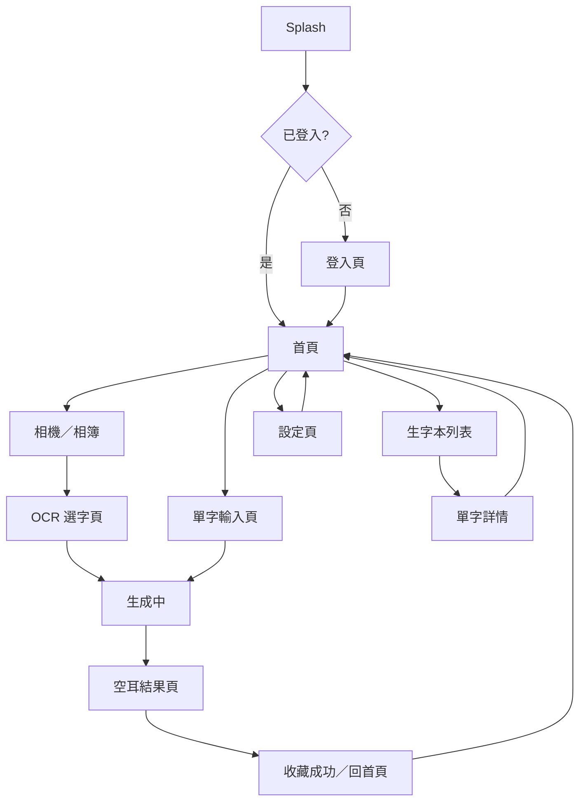

### 4.2 資訊架構（IA）

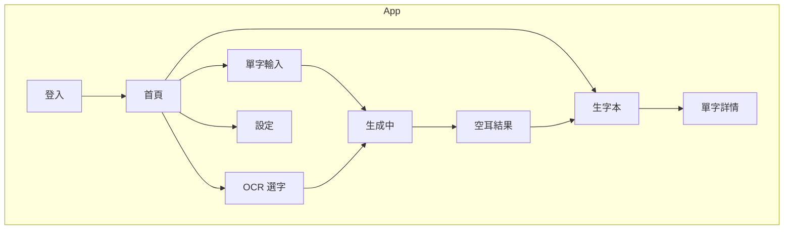

### 4.3 各頁線框（Mermaid）

#### 4.3.1 登入頁

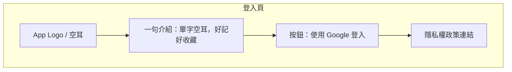

#### 4.3.2 首頁

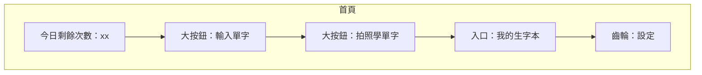

#### 4.3.3 單字輸入頁

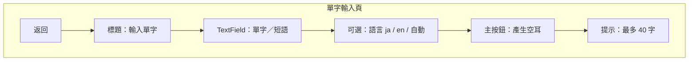

#### 4.3.4 OCR 選字頁

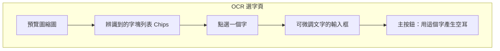

#### 4.3.5 生成中

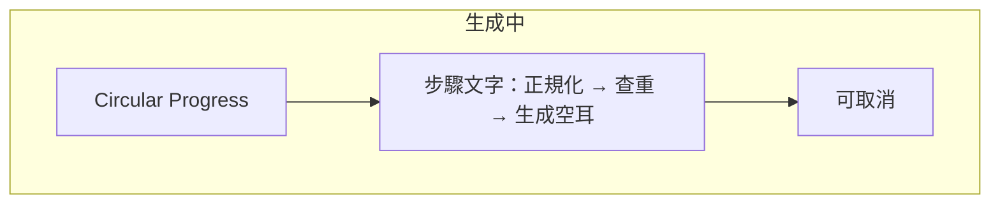

#### 4.3.6 空耳結果頁

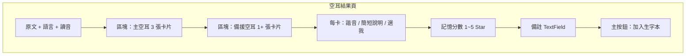

#### 4.3.7 生字本列表

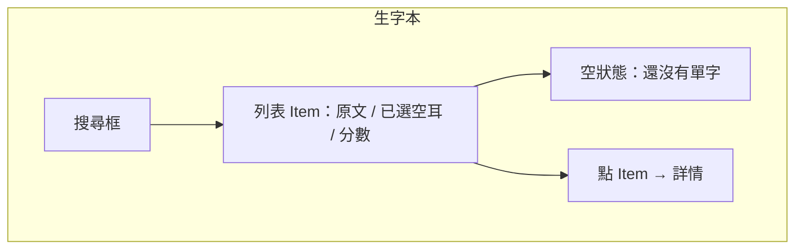

#### 4.3.8 單字詳情

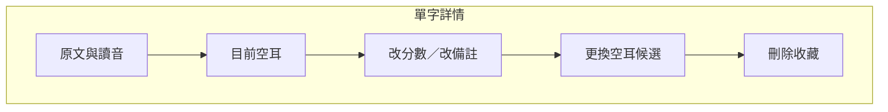

#### 4.3.9 設定頁

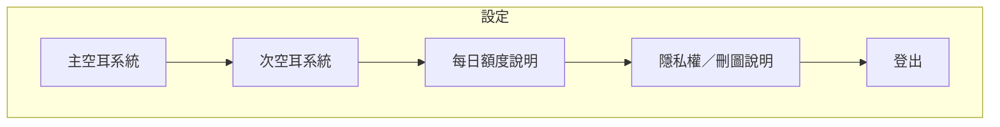

### 4.4 結果頁卡片互動（狀態）

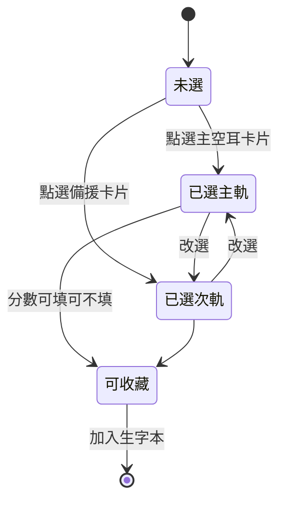

---

## 5. 系統架構（小型）

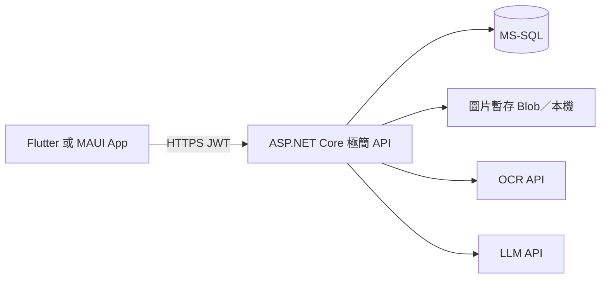

**原則**

- API Key 只在後端  
- 文字可同步回傳；圖片採 Job + 輪詢  
- 查重命中則不呼叫 LLM（或少呼叫）  

---

## 6. 適當硬體支援列表

### 6.1 使用者端（App 支援矩陣）

| 項目 | MVP 要求 | 說明 |
|------|----------|------|
| OS | Android 8.0（API 26）以上 | 覆蓋主流可上架區間 |
| RAM | ≥ 3 GB 建議 | 2 GB 可跑，相機較吃力 |
| 儲存 | 安裝後預留 ≥ 150 MB | 含快取 |
| CPU | 64-bit 建議 | 依 Flutter／套件現況 |
| 螢幕 | 5.0"～7.0" 手機優先 | 平板可用但不優化 |
| 相機 | 自動對焦鏡頭 | OCR 用途；無相機仍可以相簿 |
| 網路 | 必備連線 | AI／登入需網路 |
| 登入 | Google Play 服務 | Google Sign-In |
| 不支援 |  orthodontist 無 GMS 的特殊機（可列已知限制） | 若要用請 Phase 2 評估 |

**權限**

- 相機：現場拍照 OCR  
- 照片／媒體讀取：選圖 OCR  
- 網路：必要  

### 6.2 開發／維運端硬體

| 角色 | 建議規格 | 用途 |
|------|----------|------|
| 開發筆電 | 4 核＋ / 16 GB RAM / 512 GB SSD | Flutter + API + Docker SQL |
| 測試機 | 1～2 台 Android 實機（中低階 + 中高階） | OCR、相機、性能 |
| 可選模擬器 | PC 可跑 Android Emulator | UI 回歸 |

### 6.3 伺服器／雲端硬體（執行環境）

> 小型上架：**不必自買實體機**；以下為「適當」等級，不是企業雙機熱備。

#### 方案 A｜最省（建議 MVP）

| 元件 | 規格 | 備註 |
|------|------|------|
| API | 1 × 共用／小型運算（1–2 vCPU，1–2 GB） | Cloud Run / App Service B1 / 小 VPS |
| DB | Managed SQL 最底層或 2 vCPU／4–8 GB 共用 | Azure SQL Basic／同等 |
| Redis | 可不建 | MVP 可省 |
| 圖片 | 物件儲存 10～50 GB 起 | OCR 後可自動刪 |
| CDN | 可不用 | API 直出即可 |

#### 方案 B｜略穩（使用者上來再用）

| 元件 | 規格 |
|------|------|
| API | 2 vCPU / 4 GB，可擴到 2 實例 |
| DB | 2 vCPU / 8 GB 記憶體 |
| 備份 | 每日自動備份 |
| 監控 | 基本健康檢查 + 日誌 |

#### 方案 C｜不建議 MVP 做

- 自建 GPU  
- 多區域主動－主動  
- K8s 叢集、WAF 進階組合  

### 6.4 第三方服務（算「硬體／產能」的一部分）

| 服務 | 用途 | MVP 等級 |
|------|------|----------|
| LLM API | 空耳生成 | 低價模型即可（如 mini 級） |
| OCR API | 圖片轉字 | 雲端 OCR 按量 |
| Google Cloud／Firebase（登入） | Google Sign-In 驗證 | 標準 |
| Play Console | 上架 | 開發者帳號 |

---

## 7. 整體 Cost（成本）

> 幣別以 **TWD** 估算；匯率與雲報價會變，以下為 **2026 年規劃用區間**，採「小型工具 App、日生成量不大」。  
> 假設：日活躍 50～300、每人每日生成上限 20～30 次、查重率 30%（三成不打 LLM）。

### 7.1 一次性成本

| 項目 | 預估（TWD） | 說明 |
|------|-------------|------|
| Google Play 開發者註冊 | 約 25 USD（一次性） | 官方牌價為準 |
| 網域（隱私權網址） | 300～800／年 | 可與現有站共用 |
| 隱私權頁託管 | 0～500 | GitHub Pages 等可 0 |
| 設計（若外包 Icon／簡易 UI） | 0～15,000 | 自己做可 0 |
| 開發人力（約 4～6 週） | 視自研／外包 | 自研＝機會成本；外包另報 |

### 7.2 每月固定／半固定

| 項目 | 低用量／月 | 中用量／月 | 說明 |
|------|------------|------------|------|
| API 運算 | 0～300 | 300～1,000 | 有免額或小 VPS |
| 資料庫 | 0～500 | 500～1,500 | Managed 最底層起 |
| 圖片儲存＋流量 | 0～100 | 100～400 | 建議 OCR 後刪原圖 |
| 監控／雜支 | 0～100 | 100～300 | |
| **小計（基礎設施）** | **約 0～1,000** | **約 1,000～3,200** | |

### 7.3 變動成本（AI，通常最大）

| 項目 | 假設 | 月估（TWD） |
|------|------|-------------|
| LLM | 每次有效生成約數百～數千 tokens；日 500 次生成 | 約 300～2,500 |
| OCR | 日 150 張圖 | 約 200～1,500 |
| **AI 小計** | — | **約 500～4,000** |

**控成本槓桿**

1. 每日每用戶上限（例如 30）  
2. 查重命中不呼叫 LLM  
3. 同字全域快取空耳  
4. 圖片壓縮＋OCR 後刪圖  
5. 低價模型＋失敗重試最多 1 次  

### 7.4 合計情境（營運／月）

| 情境 | DAU | 月基礎設施 | 月 AI | **月總計約** |
|------|-----|------------|-------|--------------|
| 內測 | ＜30 | 0～500 | 100～500 | **200～1,000** |
| 上架初期 | 50～150 | 500～1,500 | 500～2,000 | **1,000～3,500** |
| 小有成長 | 200～500 | 1,000～3,000 | 2,000～6,000 | **3,000～9,000** |

### 7.5 首年成本粗算（不含人力）

| 項目 | 約略 |
|------|------|
| 一次性上架與網域 | 1,000～3,000 |
| 年基礎設施＋AI（初期偏保守） | 12,000～50,000 |
| **首年現金支出（無外包設計／無雇人）** | **約 1.5 萬～5.5 萬 TWD** |

### 7.6 人力工期（機會成本）

| 階段 | 時間 |
|------|------|
| API + DB + 假 AI | 1 週 |
| 真 LLM + 生字本 + 登入 | 1 週 |
| OCR + Job + 配額 | 1 週 |
| UI 拋光 + 內測 | 1 週 |
| Play 上架材料 + 審核修補 | 1 週 |
| **合計** | **約 5 週**（一人全職估） |

---

## 8. 技術設計（精簡）

### 8.1 建議技術棧

| 層 | 選型 |
|----|------|
| App | Flutter（上 Play 省事）或 .NET MAUI |
| API | ASP.NET Core 8/9 Minimal API |
| DB | MS-SQL |
| 登入 | Google Sign-In → 後端換 JWT |
| OCR / LLM | 雲端 API |

### 8.2 資料表（邏輯）

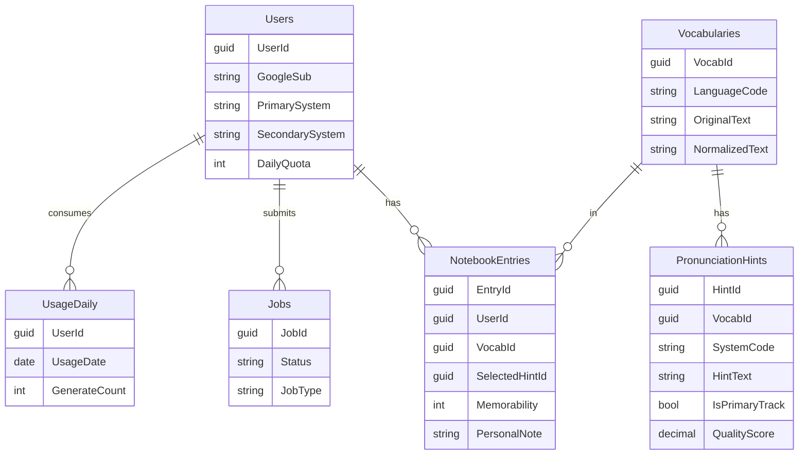

### 8.3 API 一覽

| Method | Path | 說明 |
|--------|------|------|
| POST | `/api/auth/google` | 登入 |
| GET | `/api/me` | 偏好／剩餘次數 |
| PATCH | `/api/me/settings` | 主次系統 |
| POST | `/api/vocab/text` | 單字生成 |
| POST | `/api/vocab/image` | 上傳圖 |
| GET | `/api/jobs/{id}` | 輪詢 |
| POST | `/api/jobs/{id}/confirm` | OCR 確認字 |
| POST | `/api/notebook` | 收藏 |
| GET | `/api/notebook` | 列表 |

### 8.4 文字序列（重點）

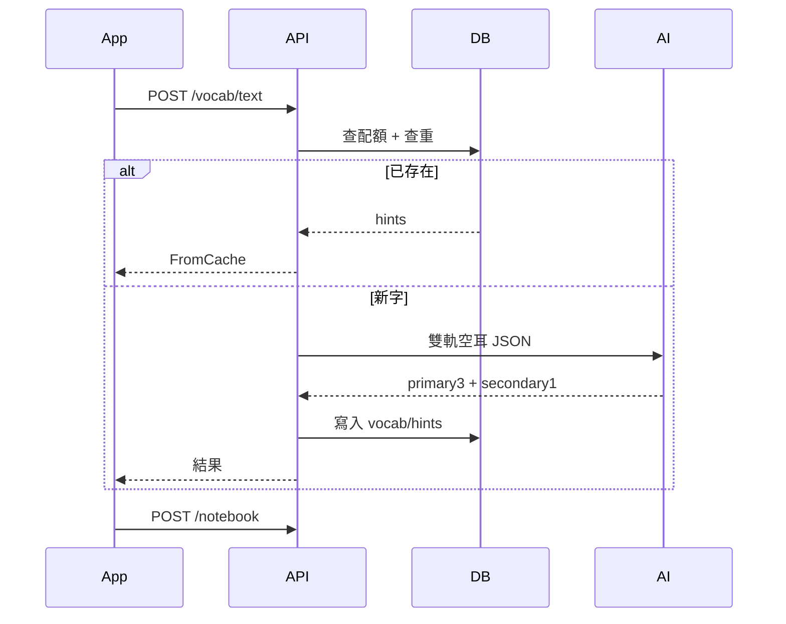

---

## 9. 部署維運（小型）

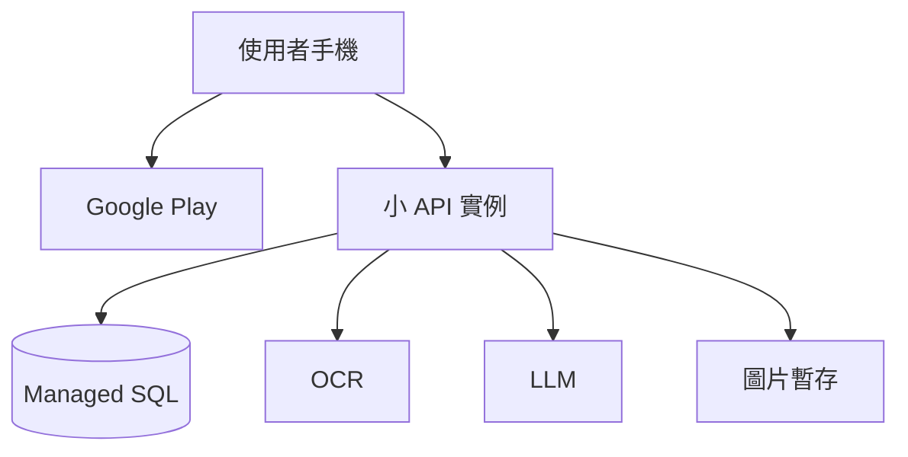

| 項目 | MVP 做法 |
|------|----------|
| 發佈 | AAB 上 Play |
| 設定 | 環境變數放 Key |
| 備份 | SQL 每日自動備份 |
| 日誌 | 請求 log + AI 失敗率 |
| 告警 | 5xx、AI 日費用上限 |
| 圖片 | OCR 後 24h～7 天刪除 |

---

## 10. 上架檢核（Google Play）

- [ ] 隱私權政策 URL（相機／照片／帳號／文字送 AI）  
- [ ] 資料安全表單填寫  
- [ ] 權限只有相機與相片，用途說明清楚  
- [ ] 無未披露蒐集  
- [ ] API Key 未打進 APK  
- [ ] 商店截圖：首頁、輸入、結果、生字本  
- [ ] 內容分級：工具／教育  
- [ ] 測試軌道內測後再正式版  

---

## 11. 時程

| 週 | 交付 |
|----|------|
| W1 | DB＋API 文字流＋Mock AI |
| W2 | Google 登入＋真 LLM＋生字本 |
| W3 | OCR Job＋配額＋設定 |
| W4 | UI 完成＋實機測試 |
| W5 | 隱私權、上架、審核修補 |

---

## 12. 風險與對策

| 風險 | 對策 |
|------|------|
| AI 月費暴衝 | 每日上限 + 查重快取 + 費用告警 |
| 空耳不好記 | 多候選 + 使用者評分排序 |
| OCR 錯字 | 強制人工點選／改字 |
| 審核／隱私 | 早寫隱私權、少留原圖 |
| 範圍膨脹 | 本文件 Out of Scope 凍結 |

---

## 13. 成功指標（上線 4～6 週）

| 指標 | 目標 |
|------|------|
| 生成技術成功率 | ≥ 95% |
| 生成後有收藏 | ≥ 40% |
| 關鍵路徑 P95 | 文字 ＜ 8 秒 |
| Crash-free | ≥ 99% |
| 月基礎設施+AI（初期） | 盡量落在 1 千～3.5 千 TWD 情境 |

---

## 14. 結論

本 MVP 是 **Google Play 小型工具 App**，不是企業級大平台。  

**最小閉環**：`單字／圖片 → 雙軌空耳 → 生字本`  

**硬體**：使用者一般 Android 手機即可；後端 1 小 API + 小 SQL + 雲 OCR/LLM。  
**成本**：無人力時，首年現金常見落在約 **1.5 萬～5.5 萬 TWD** 規劃區間（視 AI 用量）。  
**畫面**：本文件 Mermaid 線框可直接當 UI 實作清單。

---

## 15. 下一步（施工件）

| 編號 | 交付物 |
|------|--------|
| A | 完整 `schema.sql` + 預存程序 |
| B | `VocabService` + Minimal API 可編譯骨架 |
| C | LLM Prompt全文 + JSON 驗收規則 |
| D | Flutter 頁面路由與元件清單 |
| E | Play 隱私權文案大綱 |

需要哪一份，直接回編號即可。