# Google Play 小型 APP MVP 規劃書 v1.1
> 目標：以最小成本上架 Google Play 的小型外語空耳學習 APP  
> 範圍：只做「單字輸入、圖片上傳、AI 候選空耳、收藏查詢」

---

## 1. 專案目標
建立一個輕量 APP，讓使用者輸入單字或上傳圖片後，系統可自動辨識文字、分析發音、產生空耳候選，讓使用者自行判斷是否好記並收藏。

---

## 2. MVP 功能清單

### 2.1 必要功能
- 單字輸入
- 圖片上傳
- OCR 文字辨識
- AI Agent 語言判定
- AI Agent 發音推論
- AI Agent 空耳候選生成
- 重複詞條檢查
- 顯示候選結果
- 使用者手動選擇
- 收藏詞條
- 查詢收藏詞條

### 2.2 暫不實作
- 文章匯入
- 音訊辨識
- 梗圖生成
- 社群功能
- 排行榜
- 測驗系統
- 熱門新番詞庫

---

## 3. 畫面設計（Mermaid）

### 3.1 畫面流程圖
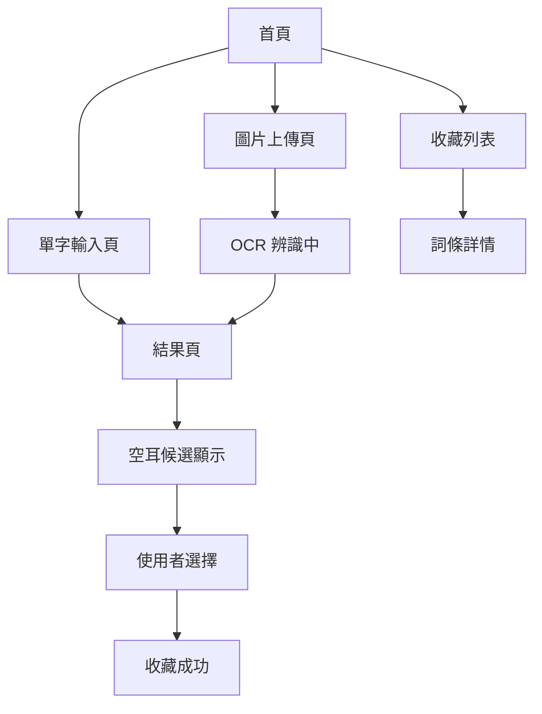

### 3.2 首頁畫面 Design
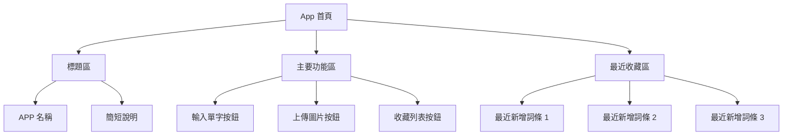

### 3.3 單字輸入頁 Design
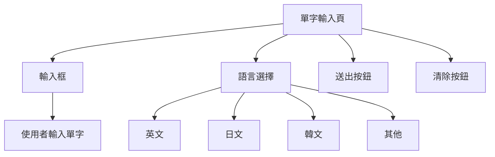

### 3.4 圖片上傳頁 Design
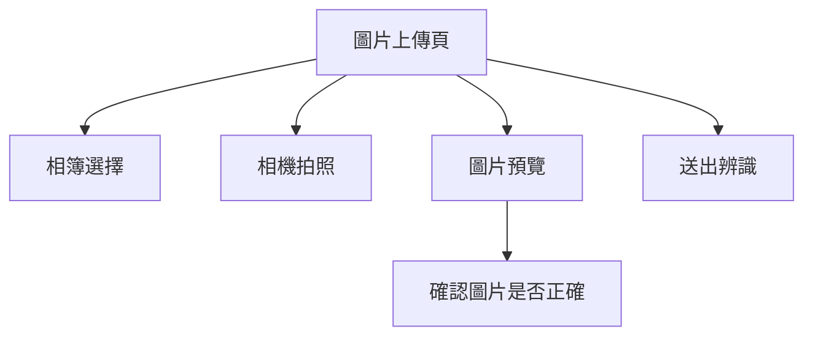

### 3.5 結果頁 Design
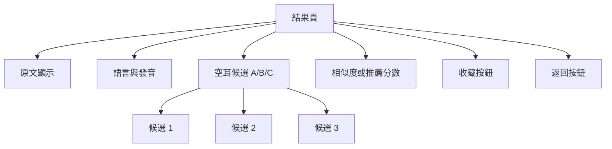

---

## 4. 畫面流程圖（User Flow）

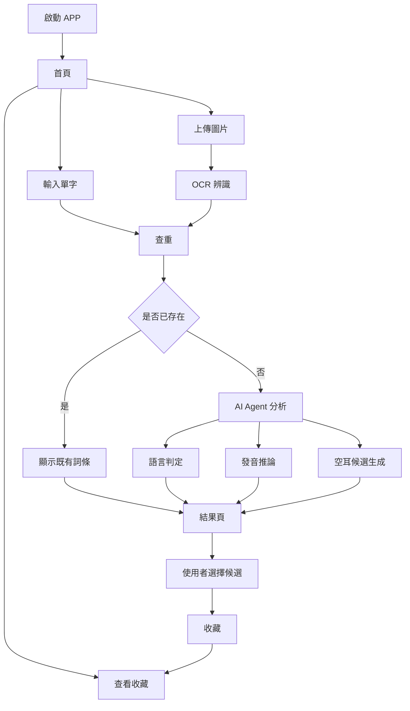

---

## 5. 系統架構圖

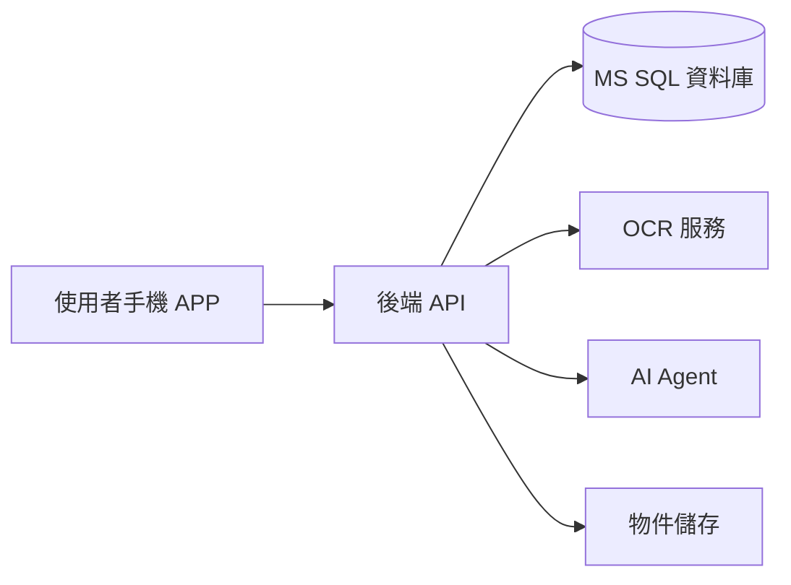

---

## 6. 資料表草案（ERD）

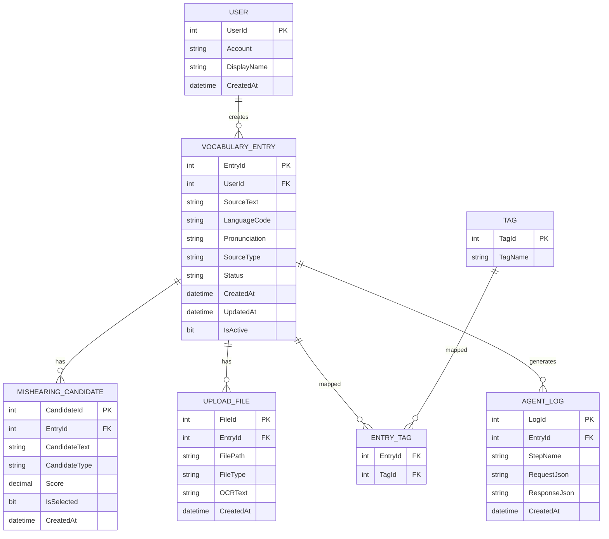

### 6.1 資料表重點
- `VOCABULARY_ENTRY`：詞條主檔
- `MISHEARING_CANDIDATE`：空耳候選
- `UPLOAD_FILE`：圖片與 OCR 結果
- `TAG` / `ENTRY_TAG`：標籤分類
- `AGENT_LOG`：AI 處理紀錄

---

## 7. 狀態轉移圖

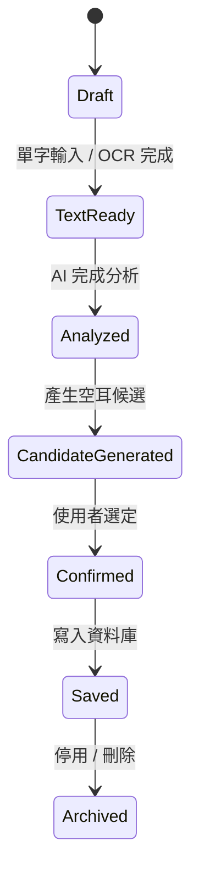

---

## 8. 循序圖

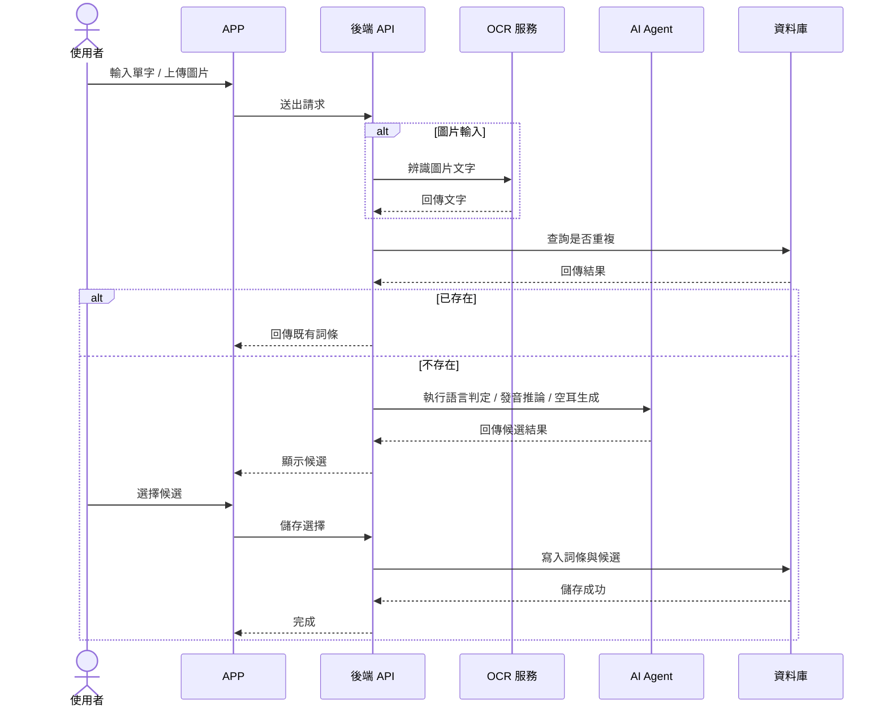

---

## 9. 最小硬體支援列表

> 這是「小型 MVP、可上架」的最低建議，不是重型平台配置。

### 9.1 APP 端
- Android 手機
- Android 10 以上優先
- RAM 4GB 以上可順暢使用
- 儲存空間預留 200MB 以上
- 支援相機、相簿、網路連線

### 9.2 後端服務
- 4 vCPU
- 8 GB RAM
- 80 GB SSD
- Linux 或 Windows Server 皆可
- 角色：API、AI 流程協調、查重、紀錄寫入

### 9.3 資料庫服務
- 4 vCPU
- 8 GB RAM
- 100 GB SSD
- MS SQL Server
- 角色：詞條、候選、收藏、日誌

### 9.4 外部服務
- OCR API
- AI API
- 物件儲存空間
- 不建議 MVP 階段自架大型模型

---

## 10. 整體 Cost（MVP 估算）

> 以下為小型 MVP 的估算方向，目的是抓預算級距，不是精算報價。

### 10.1 一次性開發成本
| 項目 | 說明 | 估算區間 |
|---|---|---:|
| UI/UX | 4 個主要畫面 | 3 ~ 8 萬 |
| APP 前端開發 | Android App | 8 ~ 20 萬 |
| 後端 API | 查重、收藏、流程 | 8 ~ 18 萬 |
| OCR / AI 串接 | 圖片辨識、候選產生 | 6 ~ 15 萬 |
| DB 設計 | 資料表、索引、查重 | 3 ~ 8 萬 |
| 測試與修正 | 功能測試、上架修正 | 3 ~ 10 萬 |

**一次性總成本約：31 ~ 79 萬**

### 10.2 每月維運成本
| 項目 | 說明 | 估算區間 |
|---|---|---:|
| App Server | 4C/8G VM | 1,500 ~ 4,000 |
| DB Server | 4C/8G VM | 2,000 ~ 5,000 |
| 物件儲存 | 圖片存放 | 200 ~ 800 |
| OCR API | 依使用量 | 500 ~ 5,000 |
| AI API | 依使用量 | 1,000 ~ 8,000 |
| Log / 監控 | 基本監控 | 300 ~ 1,000 |

**每月總成本約：5,500 ~ 23,800**

### 10.3 Google Play 與其他費用
- Google Play 開發者帳號：一次性註冊費
- 網域名稱：每年費用
- 若需正式上線，需預留客服與維護人力成本

---

## 11. 部署圖

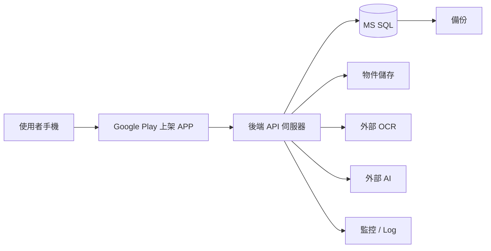

---

## 12. 部署維運重點
- 使用 App Bundle 上架
- 控制 App 體積
- 圖片與 AI 分離處理
- 每日備份資料庫
- 記錄 AI 回應與 OCR 結果
- 對失敗請求做重試與提示
- 保留使用者選擇紀錄，方便後續優化

---

## 13. 上架注意事項
- 新 App 需符合 Google Play 的相容性要求
- 需注意 16 KB page size 支援
- 不要把大型模型包進 App
- 檔案上傳、OCR、AI 分離處理，避免安裝包過大
- 優先採用 Android App Bundle

---

## 14. MVP 驗收標準
- 可輸入單字
- 可上傳圖片
- 可成功 OCR
- 可產生空耳候選
- 可查重
- 可收藏
- 可查詢收藏
- 可穩定上架 Google Play

---

## 15. 結論
這版 MVP 的重點是：
- **小**
- **穩**
- **可上架**
- **可擴充**

先把主流程做通，再考慮多語言、社群、進階學習功能。

---
1. **再更精簡成 1 頁提案版**
2. **轉成 PRD 正式規格格式**
3. **補上 API 規格表**
4. **補上資料庫 SQL DDL**
5. **補上 Android 畫面 wireframe 清單**