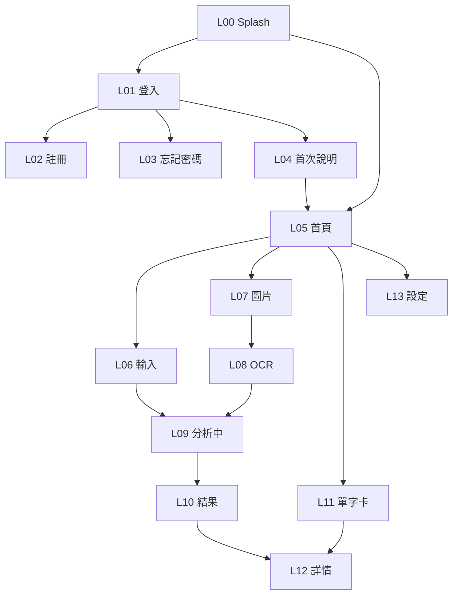

# Stitch 畫面設計交付書｜空耳學單字

> 文件版本：v1.0｜日期：2026-08-06  
> 用途：**單獨交付 Google Stitch 產出高保真 UI**  
> 對應規格：`Cursor-MVP App 規劃書.md` 第二章畫面  
> 產品暫名：Soraeru／空耳學單字  
> 平台：Android 手機直式（優先輸出 390×844 或同級 Mobile frame）

---

## 0. 給 Stitch 的專案說明

### 0.1 產品一句話

台灣使用者輸入或拍照取得**外語單字**，App 用 AI 產生**華語空耳近似音**幫助記憶；需登入，支援多語自動偵測。

### 0.2 設計目標

- 看起來像**小型語言學習工具 App**，不是儀表板、不是社群牆  
- **第一視窗品牌可辨識**：「空耳學單字」要有存在感  
- 每頁一件事；主 CTA 明確  
- 結果頁必須強調：**近似音僅供記憶，正式發音為準**  
- 圖片相關頁必須強調：**僅手機端辨識，不上傳原圖**

### 0.3 建議視覺方向

| 項目 | 建議 |
|---|---|
| 風格 | 清爽學習工具；有層次背景，避免一片純色死板 |
| 字體 | 可讀的現代中英混排；標題可稍具識別度，內文清楚 |
| 主色 | 自訂一組品牌色（避免預設紫漸層、土橙奶油報紙風） |
| 圓角 | 中等；列表與輸入框一致 |
| 圖示 | 線性或簡單填色，不用emoji當正式Icon |
| 模式 | 先出 **Light mode**；深色可選做第二輪 |
| 語言 | UI 文案用**繁體中文** |

### 0.4 Stitch 產出節奏建議

1. 先產 **Design System**（色、字、按鈕、輸入框、AppBar）  
2. 再依 L00→L13 逐頁  
3. 最後用 Stitch 串 **可點流程**：登入→首頁→輸入→結果→單字卡  

### 0.5 請 Stitch 遵守的硬規則

- 每頁最多 **1 個**實心 Primary 按鈕  
- 首頁不要塞統計看板、週曆、廣告卡  
- 結果頁警示條不可省略  
- 不要做 iOS 分頁當 MVP 重點；以 Android Material 親和為主即可  
- 不要加入 SRS 複習頁、社群、分享牆  

---

## 1. 全域 Layout

```
┌────────────────────────────┐
│ 系統狀態列                  │
├────────────────────────────┤
│ AppBar：標題｜右側次要動作   │
├────────────────────────────┤
│                            │
│  Content（可捲動）           │
│                            │
├────────────────────────────┤
│ Primary CTA / 底欄（可選）  │
└────────────────────────────┘
```

| 規則 | 說明 |
|---|---|
| 主按鈕 | 每頁最多一個實心 Primary |
| 次按鈕 | 文字鍵或線框 |
| 額度 | 首頁、設定顯示「今日剩餘 AI 次數」 |
| 語系 | 輸入頁預設「自動偵測」 |

---

## 2. 畫面總表

| 代碼 | 畫面名稱 | 需登入 | Stitch 優先 |
|---|---|---:|---:|
| L00 | Splash | 否 | P0 |
| L01 | 登入 | 否 | P0 |
| L02 | Email 註冊 | 否 | P0 |
| L03 | 忘記密碼 | 否 | P1 |
| L04 | 首次使用說明 | 是 | P0 |
| L05 | 首頁 | 是 | P0 |
| L06 | 單字輸入 | 是 | P0 |
| L07 | 圖片選擇 | 是 | P0 |
| L08 | OCR 選字 | 是 | P0 |
| L09 | 分析中 | 是 | P1 |
| L10 | 分析結果 | 是 | P0 |
| L11 | 我的單字卡 | 是 | P0 |
| L12 | 單字卡詳細 | 是 | P0 |
| L13 | 設定／帳號 | 是 | P0 |

---

## 3. 畫面間流程



---

## 4. 逐頁線框與 Stitch Prompt

> 每頁含：**線框**、**元件表**、**可直接貼給 Stitch 的 Prompt**。

---

### L00 Splash

**畫面目標**：品牌曝光＋判斷 Session。

```
┌────────────────────────────┐
│                            │
│                            │
│         [ App Icon ]       │
│       空耳學單字            │
│    用發音，記住外語         │
│                            │
│         ◌ 載入中…          │
│                            │
└────────────────────────────┘
```

| 區塊 | 內容 |
|---|---|
| 置中品牌 | Icon＋名稱＋標語 |
| 狀態 | 載入指示 |

**Stitch Prompt**

```text
Design an Android mobile splash screen for a Taiwanese language-learning app named「空耳學單字」(Soraeru).
Vertical phone frame. Centered app icon, large Traditional Chinese product name「空耳學單字」, subtitle「用發音，記住外語」, subtle loading indicator at bottom of center stack.
Brand-first composition: the product name is the hero, not a tiny nav label.
Clean learning-tool mood, light mode, custom non-purple palette, readable Chinese typography, soft atmospheric background (not flat white only). No cards, no stats, no badges overlay.
Export as high-fidelity UI.
```

---

### L01 登入

**畫面目標**：Google 或 Email／密碼登入。

```
┌────────────────────────────┐
│                            │
│       [ App Icon ]         │
│       空耳學單字            │
│  登入後同步單字卡與使用額度  │
│                            │
│  ┌──────────────────────┐  │
│  │ Email                │  │
│  └──────────────────────┘  │
│  ┌──────────────────────┐  │
│  │ 密碼           [顯示] │  │
│  └──────────────────────┘  │
│                            │
│  [        登入        ]    │
│  忘記密碼？                 │
│                            │
│  ────── 或 ──────          │
│  [  使用 Google 登入  ]    │
│                            │
│  還沒有帳號？註冊           │
│  隱私權政策                 │
└────────────────────────────┘
```

| 元件 | 說明 |
|---|---|
| Email、密碼 | 文字欄；密碼可顯示／隱藏 |
| 登入 | Primary |
| Google 登入 | Secondary |
| 忘記密碼／註冊／隱私權 | 文字連結 |

**Stitch Prompt**

```text
Design Android login screen for「空耳學單字」in Traditional Chinese.
Top: app icon + title「空耳學單字」+ helper「登入後同步單字卡與使用額度」.
Form: Email field, Password field with show/hide.
Primary filled button「登入」.
Text link「忘記密碼？」.
Divider「或」.
Secondary outline button「使用 Google 登入」.
Bottom links「還沒有帳號？註冊」and「隱私權政策」.
Light mode, clean mobile auth layout, one primary CTA only, no social feed, no extra promo cards.
```

---

### L02 Email 註冊

**畫面目標**：建立 Email 帳號。

```
┌────────────────────────────┐
│ ← 返回                      │
│ 建立帳號                    │
│                            │
│  ┌──────────────────────┐  │
│  │ 顯示名稱（選填）       │  │
│  └──────────────────────┘  │
│  ┌──────────────────────┐  │
│  │ Email                │  │
│  └──────────────────────┘  │
│  ┌──────────────────────┐  │
│  │ 密碼（至少 8 碼）     │  │
│  └──────────────────────┘  │
│  ┌──────────────────────┐  │
│  │ 確認密碼             │  │
│  └──────────────────────┘  │
│                            │
│  ☐ 我已閱讀隱私權政策       │
│                            │
│  [       建立帳號      ]   │
└────────────────────────────┘
```

| 元件 | 說明 |
|---|---|
| 顯示名稱 | 選填 |
| Email／密碼／確認密碼 | 必填 |
| 隱私核取 | 必勾才能送出 |
| 建立帳號 | Primary 固定底或內容底 |

**Stitch Prompt**

```text
Design Android register screen「建立帳號」in Traditional Chinese for「空耳學單字」.
AppBar with back and title.
Fields: 顯示名稱（選填）, Email, 密碼（至少 8 碼）, 確認密碼.
Checkbox「我已閱讀隱私權政策」.
Primary button「建立帳號」.
Simple form page, light mode, consistent input styles with login screen, no clutter.
```

---

### L03 忘記密碼

**畫面目標**：寄送重設信。

```
┌────────────────────────────┐
│ ← 返回                      │
│ 重設密碼                    │
│                            │
│ 輸入註冊 Email，我們會寄送   │
│ 重設連結。                  │
│                            │
│  ┌──────────────────────┐  │
│  │ Email                │  │
│  └──────────────────────┘  │
│                            │
│  [     寄送重設郵件     ]   │
│                            │
│  返回登入                   │
└────────────────────────────┘
```

**Stitch Prompt**

```text
Design Android forgot-password screen「重設密碼」in Traditional Chinese.
Back app bar, short explanation text, Email field, primary button「寄送重設郵件」, text link「返回登入」.
Minimal and calm, same design system as login.
```

---

### L04 首次使用說明

**畫面目標**：第一次登入後建立正確期待。

```
┌────────────────────────────┐
│                            │
│       歡迎使用空耳學單字     │
│                            │
│  1. 輸入或拍照取得外語單字   │
│  2. AI 自動判斷語言並產空耳  │
│  3. 選一個好記的近似音收藏   │
│                            │
│  ┌──────────────────────┐  │
│  │ ⚠ 近似音僅供記憶     │  │
│  │   請以正式發音為準     │  │
│  │ 📷 圖片只在手機辨識   │  │
│  │   不會上傳原圖         │  │
│  └──────────────────────┘  │
│                            │
│  [       開始使用      ]   │
└────────────────────────────┘
```

**Stitch Prompt**

```text
Design Android onboarding/welcome screen for「空耳學單字」in Traditional Chinese.
Title「歡迎使用空耳學單字」.
Three numbered steps:
1 輸入或拍照取得外語單字
2 AI 自動判斷語言並產空耳
3 選一個好記的近似音收藏
A noticeable info panel with two warnings: 近似音僅供記憶／請以正式發音為準；圖片只在手機辨識／不會上傳原圖.
Primary button「開始使用」.
Friendly educational tone, not a marketing landing page, light mode.
```

---

### L05 首頁

**畫面目標**：三個入口＋顯示今日額度。

```
┌────────────────────────────┐
│ 空耳學單字          [⚙設定] │
├────────────────────────────┤
│ 今日剩餘 AI 次數：12        │
│                            │
│ 用發音記住外語單字           │
│ 支援多語自動偵測             │
│                            │
│  ┌──────────────────────┐  │
│  │                      │  │
│  │    ⌨ 輸入單字         │  │
│  │                      │  │
│  └──────────────────────┘  │
│                            │
│  ┌──────────────────────┐  │
│  │ 📷 拍照／選擇圖片    │  │
│  │    僅手機端 OCR       │  │
│  └──────────────────────┘  │
│                            │
│  ┌──────────────────────┐  │
│  │ 📚 我的單字卡         │  │
│  └──────────────────────┘  │
│                            │
│  AI 近似音僅供記憶           │
└────────────────────────────┘
```

| 區塊 | 說明 |
|---|---|
| AppBar | 品牌名＋設定 |
| 額度 | 一行即可，不要儀表板化 |
| 主入口 | 「輸入單字」最大 |
| 次入口 | 圖片、單字卡 |
| 底聲明 | 固定一行 |

**Stitch Prompt**

```text
Design Android home screen for「空耳學單字」in Traditional Chinese.
AppBar: product name left, settings icon right.
Quota line:「今日剩餘 AI 次數：12」.
Short support copy:「用發音記住外語單字」「支援多語自動偵測」.
Three action entries stacked:
1 Large primary card/button「輸入單字」
2 Secondary「拍照／選擇圖片」with caption「僅手機端 OCR」
3 Secondary「我的單字卡」
Footer note「AI 近似音僅供記憶」.
One composition, not a dashboard. No charts, no weekly calendar, no promo banners, no floating badges on imagery.
Brand name must remain strong in the first viewport.
```

---

### L06 單字輸入

**畫面目標**：輸入外語單字並送出分析。

```
┌────────────────────────────┐
│ ← 返回          輸入單字    │
├────────────────────────────┤
│ 單字或短語                   │
│  ┌──────────────────────┐  │
│  │ 例：ขอบคุณ / salamat  │  │
│  │     / ありがとう      │  │
│  └──────────────────────┘  │
│  字數 0／50                 │
│                            │
│ 來源語言                     │
│  ┌──────────────────────┐  │
│  │ 自動偵測           ▾ │  │
│  └──────────────────────┘  │
│  ※ 可改為指定語言；不確定請留自動 │
│                            │
│ 標記偏好                     │
│  ( ● 注音  ○ 羅馬  ○ 混合 ) │
│                            │
│ 只支援單字或簡短詞組          │
│                            │
├────────────────────────────┤
│ [       開始分析       ]   │
└────────────────────────────┘
```

**Stitch Prompt**

```text
Design Android「輸入單字」screen in Traditional Chinese.
AppBar back + title.
Multiline/single text field with placeholder examples in Thai/Filipino/Japanese (ขอบคุณ / salamat / ありがとう).
Character counter 0/50.
Dropdown「來源語言」default「自動偵測」.
Helper text under dropdown.
Radio or segmented control「標記偏好」: 注音 / 羅馬 / 混合.
Helper「只支援單字或簡短詞組」.
Sticky bottom primary button「開始分析」.
Clean form focus, light mode.
```

---

### L07 圖片選擇

**畫面目標**：拍照或相簿取圖。

```
┌────────────────────────────┐
│ ← 返回          圖片取字    │
├────────────────────────────┤
│                            │
│  ┌──────────────────────┐  │
│  │                      │  │
│  │     圖片預覽區        │  │
│  │   （未選圖時示意）     │  │
│  │                      │  │
│  └──────────────────────┘  │
│                            │
│  [ 📷 拍照 ]  [ 🖼 相簿 ]  │
│                            │
│  ┌──────────────────────┐  │
│  │ 圖片僅在手機端辨識，  │  │
│  │ 不會上傳至伺服器。    │  │
│  └──────────────────────┘  │
│                            │
├────────────────────────────┤
│ [       開始辨識       ]   │
└────────────────────────────┘
```

**Stitch Prompt**

```text
Design Android「圖片取字」screen in Traditional Chinese.
AppBar back + title.
Large image preview placeholder area.
Two actions side by side:「拍照」「相簿」.
Prominent privacy notice panel:「圖片僅在手機端辨識，不會上傳至伺服器。」
Sticky primary button「開始辨識」.
Trust-focused, calm privacy messaging, no cloud-upload metaphors.
```

---

### L08 OCR 選字

**畫面目標**：校正 OCR，單選一字送分析。

```
┌────────────────────────────┐
│ ← 返回          選擇單字    │
├────────────────────────────┤
│ ┌────┐  縮圖               │
│ │img │  可返回重選圖         │
│ └────┘                      │
│                            │
│ 辨識文字（可編輯）            │
│  ┌──────────────────────┐  │
│  │ 整段 OCR 結果…        │  │
│  └──────────────────────┘  │
│                            │
│ 點選要分析的單字（單選）      │
│  ┌──────────────────────┐  │
│  │ ● 詞 A               │  │
│  │ ○ 詞 B               │  │
│  │ ○ 詞 C               │  │
│  └──────────────────────┘  │
│  ＋ 手動輸入其他單字         │
│                            │
│ 已選擇 1 個單字              │
├────────────────────────────┤
│ [     分析選定單字     ]   │
└────────────────────────────┘
```

**Stitch Prompt**

```text
Design Android OCR word-selection screen「選擇單字」in Traditional Chinese.
AppBar back + title.
Small image thumbnail top-left with reselect hint.
Editable OCR text area labeled「辨識文字（可編輯）」.
Section「點選要分析的單字（單選）」with radio list of 3 sample tokens.
Text action「＋ 手動輸入其他單字」.
Selection count「已選擇 1 個單字」.
Sticky primary「分析選定單字」.
Practical utility UI, clear hierarchy, light mode.
```

---

### L09 分析中

**畫面目標**：等待 AI；可取消。

```
┌────────────────────────────┐
│                            │
│       正在分析單字           │
│         สวัสดี              │
│                            │
│         ◌ 請稍候            │
│                            │
│  ✓ 偵測來源語言              │
│  ✓ 整理詞義及讀音            │
│  ○ 產生近似音候選            │
│                            │
│         [ 取消 ]            │
└────────────────────────────┘
```

**Stitch Prompt**

```text
Design Android loading/analyzing screen in Traditional Chinese.
Centered title「正在分析單字」, sample foreign word「สวัสดี」, spinner「請稍候」.
Progress checklist:
✓ 偵測來源語言
✓ 整理詞義及讀音
○ 產生近似音候選
Text button「取消」near bottom.
Calm waiting state, not a game loading screen.
```

---

### L10 分析結果

**畫面目標**：看詞義／正式音／選空耳候選並收藏。  
**最重要頁之一。**

```
┌────────────────────────────┐
│ ← 返回          分析結果    │
├────────────────────────────┤
│ สวัสดี                      │
│ 泰語 · th-TH                │
│                            │
│ 詞義：你好                  │
│ 正式讀音：sa-wat-dee        │
│ [ ▶ 播放正式發音 ]          │
│                            │
│ ┌────────────────────────┐ │
│ │ ⚠ 以下近似音僅供記憶   │ │
│ │   請以正式發音為準      │ │
│ └────────────────────────┘ │
│                            │
│ ○ 候選 1                   │
│   薩瓦地                   │
│   注音：ㄙㄚ ㄨㄚˇ ㄉㄧˋ    │
│   提示：把音節拆開記         │
│                            │
│ ● 候選 2                   │
│   …                        │
│                            │
│ ○ 候選 3                   │
│   …                        │
│                            │
├────────────────────────────┤
│ [重新產生] [ 儲存單字卡 ]   │
└────────────────────────────┘
```

| 規則 | UI 必須表達 |
|---|---|
| TTS | 按鈕文案寫「播放正式發音」 |
| 警示 | 不可省略、不可做成小灰字難讀 |
| 候選 | 2～3 張可單選 |
| 底欄 | 「重新產生」次要、「儲存單字卡」主按鈕 |

**Stitch Prompt**

```text
Design Android result screen「分析結果」for「空耳學單字」in Traditional Chinese. This is the key screen.
AppBar back + title.
Hero word「สวัสดี」large.
Language chip/line「泰語 · th-TH」.
Meaning「詞義：你好」, reading「正式讀音：sa-wat-dee」, button「▶ 播放正式發音」.
Highly visible warning banner:「以下近似音僅供記憶，請以正式發音為準」.
Three selectable mnemonic candidate cards (radio). Example candidate:
title 薩瓦地, zhuyin ㄙㄚ ㄨㄚˇ ㄉㄧˋ, tip 把音節拆開記. One selected.
Bottom bar: secondary「重新產生」, primary「儲存單字卡」.
Do NOT style the mnemonic as if it were official IPA. Keep formal reading and mnemonic visually distinct.
Light mode, clear hierarchy, no share button required for MVP.
```

---

### L11 我的單字卡

**畫面目標**：搜尋、篩選、瀏覽收藏。

```
┌────────────────────────────┐
│ ← 返回        我的單字卡    │
├────────────────────────────┤
│ 🔍 搜尋單字…                │
│ [全部] [英] [日] [泰] [其他] │
│                            │
│ ┌────────────────────────┐ │
│ │ สวัสดี                 │ │
│ │ 你好｜薩瓦地｜泰語       │ │
│ └────────────────────────┘ │
│ ┌────────────────────────┐ │
│ │ salamat                │ │
│ │ 謝謝｜沙拉馬｜菲        │ │
│ └────────────────────────┘ │
│                            │
│ （空狀態另做一版）           │
│ 還沒有單字卡                 │
│ [去輸入第一個字]             │
└────────────────────────────┘
```

**請 Stitch 出兩態**：有資料列表／空狀態。

**Stitch Prompt**

```text
Design Android vocabulary list「我的單字卡」in Traditional Chinese, two states.
State A (filled): AppBar back+title, search field, filter chips 全部/英/日/泰/其他, list rows showing foreign word, meaning, chosen mnemonic, language.
State B (empty): friendly empty illustration area, text「還沒有單字卡」, button「去輸入第一個字」.
Keep cards subtle; this is a list for browsing, not a social feed.
```

---

### L12 單字卡詳細

**畫面目標**：檢視已存卡片，可刪除與播正式音。

```
┌────────────────────────────┐
│ ← 返回          單字卡      │
├────────────────────────────┤
│ สวัสดี                      │
│ 來源語言：泰語               │
│                            │
│ 詞義：你好                  │
│ 正式讀音：sa-wat-dee        │
│ [ ▶ 播放正式發音 ]          │
│                            │
│ ── 我的近似音 ──            │
│ 薩瓦地                      │
│ 注音：ㄙㄚ ㄨㄚˇ ㄉㄧˋ       │
│ 記憶提示：…                 │
│                            │
│ 建立時間：2026-08-06        │
│                            │
│ [        刪除單字卡      ] │
└────────────────────────────┘
```

**Stitch Prompt**

```text
Design Android vocabulary detail screen in Traditional Chinese.
Large foreign word, language line, meaning, formal reading, play formal TTS button.
Section「我的近似音」with chosen mnemonic, zhuyin, memory tip.
Created date.
Destructive text/outline button「刪除單字卡」at bottom (not primary filled brand color).
Clear distinction between formal pronunciation and mnemonic.
```

---

### L13 設定／帳號

**畫面目標**：帳號、額度、偏好、登出；預留方案列。

```
┌────────────────────────────┐
│ ← 返回            設定      │
├────────────────────────────┤
│ 帳號                        │
│  名稱：Ashton               │
│  Email：a***@gmail.com     │
│  登入方式：Google / Email   │
│                            │
│ 使用額度                     │
│  今日剩餘：12／20            │
│  方案：Free                 │
│  （付費方案即將推出）         │
│                            │
│ 標記偏好預設                 │
│  ( ● 注音  ○ 羅馬  ○ 混合 ) │
│                            │
│ 關於                        │
│  再次查看使用說明            │
│  隱私權政策                  │
│  版本 1.0.0                 │
│                            │
│ [         登出         ]   │
└────────────────────────────┘
```

**Stitch Prompt**

```text
Design Android settings/account screen「設定」in Traditional Chinese.
Sections:
1 帳號: name, masked email, login method
2 使用額度: 今日剩餘 12/20, 方案 Free, note「付費方案即將推出」(not a purchase CTA yet)
3 標記偏好預設: 注音/羅馬/混合
4 關於: 再次查看使用說明, 隱私權政策, version 1.0.0
Bottom logout button.
Simple grouped settings list, light mode, no payment UI, no subscription paywall mock for MVP.
```

---

## 5. 設計系統交件請一併產出

請 Stitch 另外整理一頁／一組 **DESIGN.md 或 Tokens**：

| Token／元件 | 需求 |
|---|---|
| Color | Primary／Secondary／Danger／Warning／Surface／Text |
| Type | 標題／正文／輔助／等寬讀音可選 |
| Button | Primary、Secondary、Text、Destructive |
| Field | 預設／Focus／Error |
| Chip | 語言篩選 |
| Banner | 警示／隱私說明 |
| List row | 單字卡列 |
| AppBar | 標準返回＋標題 |

---

## 6. 交付驗收清單

Stitch 完成後請確認：

- [ ] L00～L13 皆有高保真畫面  
- [ ] L11 含空狀態  
- [ ] L10 警示條清楚可見  
- [ ] L07 隱私說明清楚可見  
- [ ] 全站繁中文案與本文件一致  
- [ ] 僅 1 個主 CTA／頁  
- [ ] 可串起：登入→首頁→輸入→分析中→結果→單字卡  
- [ ] 匯出 DESIGN.md／標記供 Cursor／VS2026 實作對照  

---

## 7. 一次貼給 Stitch 的總開場 Prompt

```text
You are designing a complete Android MVP app UI in Traditional Chinese for「空耳學單字」(Soraeru), a Taiwan pronunciation-mnemonic vocabulary app.

Product: user signs in (Google or email), types a foreign word or picks a photo for on-device OCR, AI auto-detects language, returns meaning + formal reading/TTS + 2–3 Chinese 「空耳」mnemonic candidates, user saves to notebook. Quota shown on home/settings. Future paid plan is only previewed, not billed.

Screens to generate with consistent design system: L00 Splash, L01 Login, L02 Register, L03 Forgot password, L04 Onboarding, L05 Home, L06 Word input, L07 Image pick, L08 OCR select, L09 Analyzing, L10 Result, L11 Notebook list (+ empty), L12 Notebook detail, L13 Settings.

Hard rules:
- Brand name must feel hero-level on splash/home
- One primary CTA per screen
- Not a dashboard; no stats strips, calendars, feed cards
- Result screen must clearly warn mnemonics are memory aids only; formal pronunciation is separate
- Image screens must say OCR is on-device and original images are not uploaded
- Avoid default purple gradient AI look; light mode first; readable Chinese typography
- No SRS review screen, no iOS-first chrome, no social/share wall

Start with design tokens/components, then screens L00→L13, then interactive flow between login → home → input → result → notebook.
```

---

## 8. Stitch 產出對齊檢視

> 檢視來源：`stitch_soraeru_mnemonic_vocabulary_app/`  
> 檢視日期：2026-08-06  
> 結論：**L00～L13 已齊，DESIGN.md 可用；實作前建議修正下列差異。**

### 8.1 資料夾對照

| 代碼 | 資料夾 | 狀態 |
|---|---|---|
| Design System | `soraeru/DESIGN.md` | ✓ Deep Teal／Hanken＋Noto＋JetBrains Mono |
| L00 | `l00_splash_screen` | ✓ |
| L01 | `l01_login_screen` | ✓ |
| L02 | `l02_register_screen` | ✓ |
| L03 | `l03_forgot_password_screen` | ✓ |
| L04 | `l04_onboarding_screen` | ✓ |
| L05 | `l05_home_screen` | △ 需微調 |
| L06 | `l06_word_input_screen` | ✓ |
| L07 | `l07_image_pick_screen` | ✓ |
| L08 | `l08_ocr_select_screen` | ✓ |
| L09 | `l09_analyzing_screen` | ✓ |
| L10 | `l10_analysis_result` | △ AppBar 建議改返回 |
| L11 | `l11_notebook_list_screen` | △ 缺空狀態／確認返回 |
| L12 | `l12_notebook_detail_screen` | ✓ |
| L13 | `l13_settings_screen` | △ 額度文案／升級鈕 |

### 8.2 做得好的地方

- 色票避開紫漸層，Deep Teal 專業、適合學習工具  
- L07 隱私、L10 警示條都有「一等公民」處理  
- L06 有自動偵測＋注音／羅馬偏好  
- L10 正式音與空耳候選視覺分離清楚  
- 字體分層合理：標題／內文／注音 mono  

### 8.3 建議修正

| 優先 | 畫面 | 問題 | 實作對齊建議 |
|---|---|---|---|
| P0 | L05 首頁 | AppBar 顯示英文 `Soraeru`＋漢堡選單；右側是帳號圖示 | 改為「空耳學單字」＋右側⚙設定；首頁不需漢堡 |
| P0 | L05 | 底部 `Home / Notebook / Settings` 英文底欄 | MVP 改繁中，或拿掉底欄、改用首頁三入口＋設定 Icon |
| P0 | L10 | AppBar 是 menu＋Soraeru＋account，不像「分析結果」子頁 | 改←返回＋標題「分析結果」 |
| P0 | L13 | 額度寫「本月剩餘 42/50 句」＋醒目「升級方案」 | 改「今日剩餘：12／20」；方案 Free＋「付費方案即將推出」弱提示，勿像付費 CTA |
| P1 | L04 | 文案「隨時複習」易暗示 SRS | 改「存入單字卡隨時查看」 |
| P1 | L05 | 雙入口：大卡「輸入」＋底欄又有 Home/Notebook | 擇一導覽模型，避免兩套 IA |
| P1 | L11 | 規格要求空狀態 | 補「還沒有單字卡／去輸入第一個字」 |
| P1 | L01 | Label 用 Email／Password | 可維持；若全站繁中則改「電子郵件／密碼」 |
| P2 | 多頁 | `max-w-[390px]`／`600px` 預覽框 | MAUI 實作改全螢幕安全區，勿硬套手機外框 |
| P2 | L08 | 縮圖用外部示範圖 URL | 實作改綁本機選圖／URI |
| P2 | 字體 | Hanken Grotesk 需授權／打包 | Android 用可商用字或系統字對應 tokens |

### 8.4 MAUI 實作對齊建議

1. **先抽 Tokens**：把 `DESIGN.md` 的 colors／type／radius／spacing 建成 `Resources/Styles/Colors.xaml`＋`Styles.xaml`。  
2. **導覽定案**：建議  
   - Shell：登入堆疊／主頁堆疊  
   - 首頁三入口為主；設定走 AppBar Icon  
   - **不要**同時做英文 BottomNav＋首頁大卡（二選一，推推薦後者）  
3. **HTML→XAML**：以區塊對齊，不要逐 class 搬 Tailwind。  
4. **畫面優先實作序**：L01 → L05 → L06 → L09 → L10 → L11 → L12 → 其餘。  
5. **以規劃書為準**：額度＝每日、無上線金流、無 SRS。  

### 8.5 驗收更新

- [x] L00～L13 皆有画面檔  
- [x] DESIGN.md 已匯出  
- [x] L10 警示／L07 隱私可見  
- [ ] L05／L10 AppBar 與規格一致  
- [ ] L05 導覽模型單一（無雙重底欄衝突）  
- [ ] L11 空狀態  
- [ ] L13 今日額度＋非付費 CTA  
- [ ] L04 去掉「複習」暗示  

---

## 9. 可貼回 Stitch 的修正 Prompt

```text
Please revise the existing Soraeru /「空耳學單字」Android screens to match the frozen MVP specs. Keep the current Deep Teal design system (colors, Hanken Grotesk / Noto Sans / JetBrains Mono, banners, sticky bars). Only fix these issues:

1) L05 Home
- AppBar title must be Traditional Chinese「空耳學單字」(not English Soraeru).
- Right action = settings gear. Remove hamburger/menu and account avatar from AppBar.
- Remove the English BottomNav (Home/Notebook/Settings). Navigation is: three home entries (輸入單字 / 拍照／選擇圖片 / 我的單字卡) + settings icon.
- Keep quota as「今日剩餘 AI 次數：12」and the mnemonic disclaimer.

2) L10 Analysis Result
- Change AppBar to back arrow + title「分析結果」(not menu + Soraeru + account).
- Keep warning banner, formal TTS button, 3 mnemonic radio cards, bottom「重新產生」+ primary「儲存單字卡」.

3) L11 Notebook list
- Ensure back arrow + title「我的單字卡」.
- Add EMPTY STATE: message「還沒有單字卡」+ button「去輸入第一個字」.
- Keep search + language chips for filled state.

4) L13 Settings
- Quota section must show DAILY quota「今日剩餘：12／20」, plan label「Free」or「免費方案」, and a soft note「付費方案即將推出」.
- Remove or demote any strong「升級方案」purchase CTA (no Play Billing UI in MVP).
- Keep logout, notation preference, privacy link.

5) L04 Onboarding
- Replace wording that says users can「複習」/ review like SRS.
- Use「存入單字卡隨時查看」instead.

6) Consistency
- Prefer Traditional Chinese UI chrome on all screens.
- One primary CTA per screen.
- Do not add SRS review screens or payment checkout.

Return updated screens for L04, L05, L10, L11, L13 only.
```

---

*本文件僅含畫面設計交付內容；業務規則與 API 以 `Cursor-MVP App 規劃書.md` 為準。*
